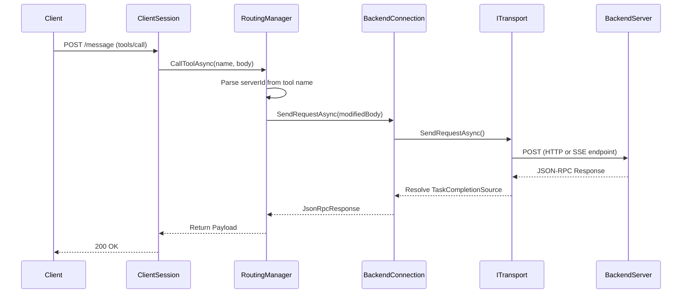

# MCP Router Architecture

This document outlines the internal architecture and design patterns used within the C# MCP Router. The codebase follows SOLID principles to ensure maintainability, testability, and clear separation of concerns.

## Core Components

The router's core logic resides within the `/Core` namespace, which is broken down into several specialized sub-systems.

### 1. Connection & Session Management
- **`ClientSession`**: Acts as the central orchestrator for a single connected client. Rather than executing logic directly, it delegates processing to specialized routing managers.
- **`BackendConnection`**: A unified facade that manages the connection to a single backend MCP server. It encapsulates a transport strategy (HTTP or SSE) and state tracking, shielding the rest of the application from backend protocol differences.

### 2. Transport Layer (`McpRouter.Core.Transports`)
The transport system abstracts the physical connection to backend servers.
- **`ITransport`**: Defines the standard interface for sending requests, notifications, and starting background readers.
- **`SseTransport`**: Implements asynchronous, persistent Server-Sent Events connections (Stateful / Legacy).
- **`HttpTransport`**: Implements stateless Streamable HTTP connections (Modern). Reads response streams line-by-line using a streaming buffer to prevent hanging on persistent chunked event streams, and handles empty responses for one-way notifications.
- **`JsonRpcStateManager`**: A thread-safe concurrency manager that tracks pending JSON-RPC requests across transports using `ConcurrentDictionary` and `TaskCompletionSource`.

### 3. Routing Layer (`McpRouter.Core.Routing`)
The routing layer is responsible for intercepting client requests, rewriting request payloads (such as virtual URIs or namespaced tools), and forwarding them to the appropriate backend.
- **`ToolRoutingManager`**: Manages the aggregation, caching, and execution of tools across all connected servers. It handles the `serverId__toolName` namespace mapping.
- **`ResourceRoutingManager`**: Manages the discovery and retrieval of MCP resources, mapping backend URIs to virtual `mcp://{serverId}/{uri}` endpoints.
- **`PromptRoutingManager`**: Handles prompt discovery and execution using the same namespacing strategy as tools.
- **`SemanticSearchService`**: An independent service responsible for in-memory TF-IDF vectorization and cosine similarity scoring. This powers the Meta-Mode `search_tools` functionality.

### 4. Native Tools (`McpRouter.CustomTools`)
- **`ICustomTool`**: An interface for defining natively executed C# tools.
- **`CustomToolRegistry`**: A dynamic service locator that registers and retrieves native tools on-demand. Native tools bypass the backend transport layer entirely.

### 5. Semantic Search & Embeddings (`McpRouter.Services` & `McpRouter.Core.Routing`)
To support intent-based tool filtering, the router includes an advanced semantic vector scoring engine:
- **`IEmbeddingService`**: Common interface for text tokenization and embedding generation.
- **`DynamicEmbeddingService`**: A singleton proxy that manages configuration state. It resolves settings from the SQLCipher-encrypted SQLite database and dynamically hot-swaps between API-based and local ONNX-based providers.
- **`OnnxEmbeddingService`**: Implements in-process, CPU-friendly embeddings using **ONNX Runtime** and a local **`all-MiniLM-L6-v2`** BERT tokenizer model.
- **`ApiEmbeddingService`**: Implements client requests calling external OpenAI-compliant embeddings APIs (such as LiteLLM, Open WebUI, or OpenAI).
- **`SemanticSearchService.SearchToolsSemanticAsync`**: Maps intent queries to tools by calculating cosine similarity scores between the query vector and cached tool description vectors.

## Dependency Injection & Pipeline Setup
The router is built on ASP.NET Core. To keep `Program.cs` lightweight, configuration logic is encapsulated in extension methods under the `/Extensions` folder:
- **`ServiceCollectionExtensions.cs`**: Registers Database, OpenIddict (OAuth), HTTP Clients, and custom singleton/scoped services.
- **`ApplicationBuilderExtensions.cs`**: Configures the HTTP request pipeline, including CORS, Authentication, Static Files, and minimal API endpoints.

## Message Flow Diagram

