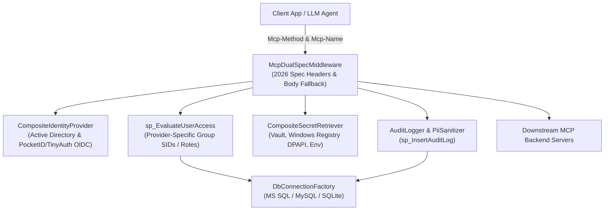

# MCP Router Architecture

This document outlines the internal architecture, security mechanisms, and design patterns used within the C# MCP Router. The codebase follows SOLID principles to ensure maintainability, testability, and clear separation of concerns.

---

## Architecture Overview

```mermaid
graph TD
    Client["Client App / LLM Agent"]
    Middleware["McpDualSpecMiddleware<br>(2026 Spec Headers & Body Fallback)"]
    Identity["CompositeIdentityProvider<br>(Active Directory & PocketID/TinyAuth OIDC)"]
    AuthEvaluator["sp_EvaluateUserAccess<br>(Provider-Specific Group SIDs / Roles)"]
    Secrets["CompositeSecretRetriever<br>(Vault, Windows Registry DPAPI, Env)"]
    Audit["AuditLogger & PiiSanitizer<br>(sp_InsertAuditLog)"]
    DbFactory["DbConnectionFactory<br>(MS SQL / MySQL / SQLite)"]
    Downstream["Downstream MCP Backend Servers"]

    Client -->|Mcp-Method & Mcp-Name| Middleware
    Middleware --> Identity
    Middleware --> AuthEvaluator
    AuthEvaluator --> DbFactory
    Middleware --> Secrets
    Middleware --> Downstream
    Middleware --> Audit
    Audit --> DbFactory
```

---

## Core Subsystems & Components

The router's core logic resides within the `/Core` namespace, organized into specialized, enterprise-grade sub-systems.

### 1. Spec Parsing & Dual-Spec Middleware (`McpRouter.Middleware`)
- **`McpDualSpecMiddleware`**: Intercepts HTTP requests and inspects **MCP 2026-07-28 Specification** headers (`Mcp-Method`, `Mcp-Name`, `MCP-Protocol-Version`). Allows sub-millisecond authorization and method resolution without stream-reading request bodies.
- **Legacy Fallback**: If 2026 headers are missing, reads and parses JSON-RPC request bodies, cleanly passing through protocol handshakes (`initialize`, `notifications/initialized`).

### 2. Pluggable Identity Providers (`McpRouter.Core.Identity`)
- **`IIdentityProvider`**: Standard abstraction for resolving caller identity and group memberships into a `UserIdentityContext`.
- **`ActiveDirectoryIdentityProvider`**: Inspects `WindowsIdentity` Kerberos/NTLM tokens and security identifiers (SIDs).
- **`OidcIdentityProvider`**: Resolves identities and group memberships from PocketID and TinyAuth reverse-proxy HTTP headers (`Remote-User`, `Remote-Groups`, `sso_groups`).
- **`CompositeIdentityProvider`**: Aggregates enabled identity providers and evaluates them in sequence.

### 3. Pluggable Secret Retrievers (`McpRouter.Core.Secrets`)
- **`ISecretRetriever`**: Standard abstraction for fetching downstream MCP server tokens and API keys.
- **`VaultSecretRetriever`**: Fetches secrets from **HashiCorp Vault** (KV v2) using `VaultSharp` with in-memory caching.
- **`WindowsRegistrySecretRetriever`**: Retrieves DPAPI-encrypted (`ProtectedData`) keys from `HKLM`/`HKCU` Windows registry hives.
- **`EnvironmentSecretRetriever`**: Reads secrets from container environment variables.
- **`CompositeSecretRetriever`**: Routes requests to the target provider based on the server's explicit `SecretProvider` database column (`Vault`, `WindowsRegistry`, or `Environment`).

### 4. Database Layer & Stored Procedure Engine (`McpRouter.Core.Database` & `scripts/db/`)
- **`IDbConnectionFactory` & `DbConnectionFactory`**: Multi-database provider producing `IDbConnection` instances for **MS SQL Server** (`Microsoft.Data.SqlClient`), **MySQL** (`MySqlConnector`), or **SQLite** (`Microsoft.Data.Sqlite`) using Dapper.
- **Stored Procedure Suites (`scripts/db/mssql/` & `scripts/db/mysql/`)**:
  - `sp_EvaluateUserAccess`: Evaluates tool authorization against AD Group SIDs or OIDC Group names.
  - `sp_GetServerSecrets`: Resolves secret paths and explicit secret providers for downstream servers.
  - `sp_SaveSecretProvider` & `sp_SaveAuthProvider`: Persists dynamic provider configuration.
  - `sp_InsertAuditLog`: Stores invocation audit records.

### 5. Observability & PII Audit Logging (`McpRouter.Core.Logging`)
- **`PiiSanitizer`**: Uses compiled Regex patterns to redact Bearer tokens, API keys, passwords, and sensitive parameter values from logged payloads.
- **`AuditLogger`**: Asynchronously records request ID, user principal name, user SID, target server, execution time, status code, and sanitized payloads via `sp_InsertAuditLog`.

### 6. Transport & Session Layer (`McpRouter.Core.Transports`)
- **`ITransport`**: Interface for downstream communication.
- **`SseTransport`**: Stateful Server-Sent Events transport.
- **`HttpTransport`**: Stateless Streamable HTTP transport with non-blocking stream buffers and empty-response handling.

---

## Configuration & Management API (`Controllers/ProvidersController.cs`)
The Web Dashboard UI communicates with REST endpoints to configure auth and secret providers dynamically:
- `GET /api/providers/auth` & `POST /api/providers/auth`
- `GET /api/providers/secrets` & `POST /api/providers/secrets`
