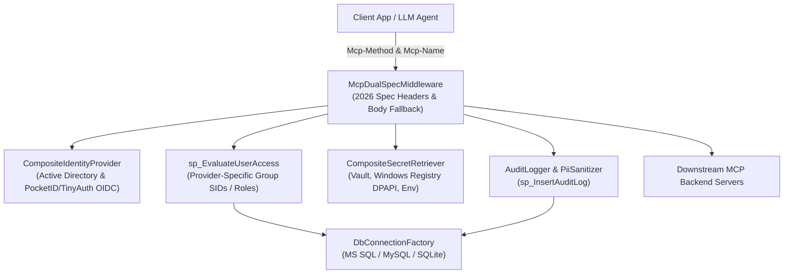
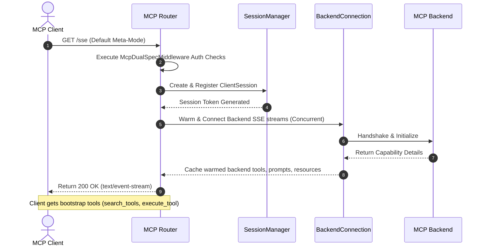
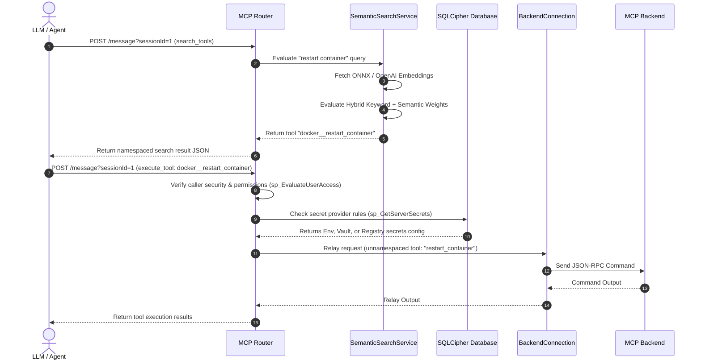
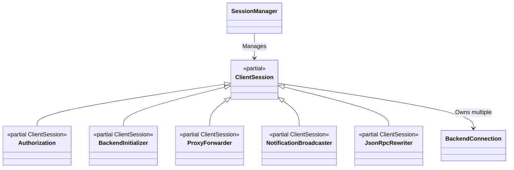
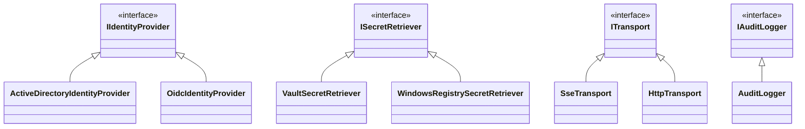
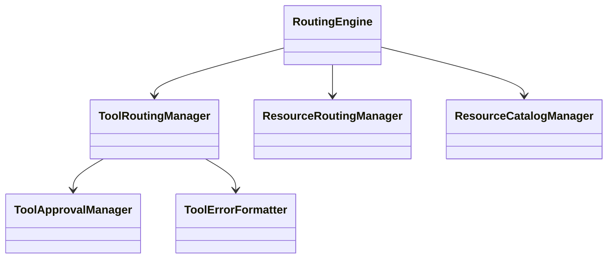

# MCP Router Architecture

This document outlines the internal architecture, security mechanisms, design requirements, and key flow diagrams of the C# MCP Router. The codebase is designed around standard enterprise design patterns to guarantee high throughput, strict security, and clear separation of concerns.

---

## 📐 Architectural Design Requirements

### 1. Performance & Latency Requirements
- **Sub-millisecond Routing Decision**: The gateway annotates request metadata based on headers (`Mcp-Method` and `Mcp-Name` compliant with the MCP 2026-07-28 Spec) without having to read or buffer the request body if present, enabling downstream components to inspect annotated metadata. Routing is ultimately body/path based.
- **Concurrent Request Handling**: Highly thread-safe design. The router must manage simultaneous SSE client channels, background health probes, and on-demand semantic search requests using thread-safe state wrappers (`ConcurrentDictionary` and thread-safe locks).
- **Background Startup Warming**: Embedding models, backend connection channels, and configuration caches must be preloaded asynchronously during server initialization. This prevents first-request latency spikes (cold starts).

### 2. Security & Identity Requirements
- **Dual Authenticated Identities**: Must support enterprise-grade Windows/Kerberos environments via Active Directory SIDs as well as modern containerized reverse-proxy identities via OIDC headers.
- **Strict Role-Based Access Control (RBAC)**: All target servers and backend tools must check caller groups using virtual mapping databases via optimized Stored Procedures.
- **Compliant Error Handling & WWW-Authenticate Headers**: In accordance with the MCP 2026-07-28 Authorization specification, the gateway must emit strict `WWW-Authenticate` challenge headers during `401 Unauthorized` and `403 Forbidden` states.
- **Data Redaction (PII)**: Any bearer tokens, credentials, API keys, or database passwords parsed in standard JSON-RPC communication must be filtered and redacted before being logged or stored.

### 3. Reliability & Resilience Requirements
- **Pluggable & Extensible Design**: Downstream transports, identity providers, and secret managers must be structured under clean strategy patterns (`ITransport`, `IIdentityProvider`, `ISecretRetriever`) to enable easy customization without touching core routing logic.
- **Robust Stateless Buffering**: When communicating with stateless streamable HTTP backends, the router must read events line-by-line using a streaming buffer. It must support fast-breaking response parsing to prevent connections from hanging indefinitely.
- **Safe Resource Cleanup**: Active SSE client sessions must handle connection terminations cleanly (preventing thread leakage) and capture disposal/cancellation exceptions gracefully.

---

## 🏛️ System Component Overview


```mermaid
graph TD
    Client["Client App / LLM Agent"]
    Middleware["McpDualSpecMiddleware<br>(2026 Spec Headers & Body Fallback)"]
    Identity["CompositeIdentityProvider<br>(Active Directory & PocketID/TinyAuth OIDC)"]
    AuthEvaluator["sp_EvaluateUserAccess<br>(Provider-Specific Group SIDs / Roles)"]
    Secrets["CompositeSecretRetriever<br>(Vault, Windows Registry DPAPI, Env)"]
    Audit["AuditLogger & PiiSanitizer<br>(sp_InsertAuditLog)"]
    DbFactory["DbConnectionFactory<br>(MS SQL / MySQL / SQLite)"]
    Downstream["Downstream MCP Backend Servers"]

    Client -->|Mcp-Method & Mcp-Name| Middleware
    Middleware --> Identity
    Middleware --> AuthEvaluator
    AuthEvaluator --> DbFactory
    Middleware --> Secrets
    Middleware --> Downstream
    Middleware --> Audit
    Audit --> DbFactory
```

### 📦 Modular Domain & Infrastructure Boundaries

The backend is organized into clear bounded modules across domain components, infrastructure, and core routing logic:

```text
├── Components/
│   ├── Servers/         # Upstream server models, validation, health checks, discovery & MapServerEndpoints
│   ├── Clients/         # Client models, credential services, OAuth & MapClientEndpoints
│   ├── AppKeys/         # AppKey models, authorization keys, hashing & MapAppKeyEndpoints
│   ├── Providers/       # Auth/secret provider settings, crypto redaction & MapProviderEndpoints
│   ├── Authorization/   # Access policies, group mappings, RBAC evaluation & MapPolicyEndpoints
│   └── Capabilities/    # Native tools, proxy execution, tool/prompt/resource handlers & MapCapabilityEndpoints
├── Infrastructure/
│   ├── Persistence/     # Dapper repositories, database connection factory, migrations & seeders
│   ├── Transports/      # SSE, HTTP, STDIO, state manager & target proxy
│   ├── Identity/        # Active Directory, OIDC, AppKey identity providers & LDAP service
│   ├── Secrets/         # Vault, Windows Registry, Environment secret retrievers & encryption
│   └── Logging/         # Audit logger, PII sanitization & in-memory log providers
└── Core/
    ├── Protocol/        # JSON-RPC protocol models & Polymorphic converter
    └── Routing/         # ClientSession, SessionManager, BackendConnection & Semantic Search
```

---

## 📡 Message & Connection Flows

### 1. SSE Client Connection Lifecycle
When an MCP client initiates a connection to the gateway:


```mermaid
sequenceDiagram
    autonumber
    actor Client as MCP Client
    participant Router as MCP Router
    participant SessionMgr as SessionManager
    participant BackendConn as BackendConnection
    participant Downstream as MCP Backend

    Client->>Router: GET /sse (Default Meta-Mode)
    Router->>Router: Execute McpDualSpecMiddleware Auth Checks
    Router->>SessionMgr: Create & Register ClientSession
    SessionMgr-->>Router: Session Token Generated
    Router->>BackendConn: Warm & Connect Backend SSE streams (Concurrent)
    BackendConn->>Downstream: Handshake & Initialize
    Downstream-->>BackendConn: Return Capability Details
    BackendConn-->>Router: Cache warmed backend tools, prompts, resources
    Router-->>Client: Return 200 OK (text/event-stream)
    Note over Client,Router: Client gets bootstrap tools (search_tools, execute_tool)
```

---

### 2. Request Routing and Execution Flow (Meta-Mode)
When an agent client attempts to search for and execute a capability:


```mermaid
sequenceDiagram
    autonumber
    actor Client as LLM / Agent
    participant Router as MCP Router
    participant SemanticSvc as SemanticSearchService
    participant DB as SQLCipher Database
    participant BackendConn as BackendConnection
    participant Downstream as MCP Backend

    Client->>Router: POST /message?sessionId=1 (search_tools)
    Router->>SemanticSvc: Evaluate "restart container" query
    SemanticSvc->>SemanticSvc: Fetch ONNX / OpenAI Embeddings
    SemanticSvc->>SemanticSvc: Evaluate Hybrid Keyword + Semantic Weights
    SemanticSvc-->>Router: Return tool "docker__restart_container"
    Router-->>Client: Return namespaced search result JSON

    Client->>Router: POST /message?sessionId=1 (execute_tool: docker__restart_container)
    Router->>Router: Verify caller security & permissions (sp_EvaluateUserAccess)
    Router->>DB: Check secret provider rules (sp_GetServerSecrets)
    DB-->>Router: Returns Env, Vault, or Registry secrets config
    Router->>BackendConn: Relay request (unnamespaced tool: "restart_container")
    BackendConn->>Downstream: Send JSON-RPC Command
    Downstream-->>BackendConn: Command Output
    BackendConn-->>Router: Relay Output
    Router-->>Client: Return tool execution results
```

---

## 🛠️ Core Codebase Organization

The codebase is organized in directories mirroring its sub-system boundaries:

- **`/Core/`**:
  - `ClientSession.cs`: Controls client connections, tracks execution threads, and rewrites JSON payloads.
  - `BackendConnection.cs`: Represents connection tunnels to upstream servers.
  - `SessionManager.cs`: Monitors all active connections and handles cleanup.
  - `ToolRoutingManager.cs` & `CustomToolRegistry.cs`: Direct semantic tool searching, registration, and routing workflows.
- **`/Middleware/`**:
  - `McpAuthorizationSpecMiddleware.cs`: Appends standard-compliant authorization challenges (`WWW-Authenticate`).
  - `McpDualSpecMiddleware.cs`: Core request interception for specification headers.
- **`/Services/`**:
  - `SemanticSearchService.cs`: Merges vector embeddings and hybrid keyword matches.
  - `BackendHealthCheckService.cs`: Periodically checks the health of downstream targets.
- **`/Extensions/`**:
  - Minimal-API handlers in `ProxyEndpointsExtensions.cs` & `ServerEndpointsExtensions.cs`: Expose SSE tunnels, server listing, inspection, and routing routes.
  - `ProvidersController.cs` (in `/Controllers/`): Controls administrative configuration for security providers.
- **`/data/`**:
  - Persistent volume holding configurations, local ONNX files, and SQLite databases.

---

## 🧩 Class Architecture & Separation of Concerns

### 1. Client Session & Modular Partial Class Architecture

```mermaid
classDiagram
    class ClientSession {
        <<partial>>
    }
    class Authorization {
        <<partial ClientSession>>
    }
    class BackendInitializer {
        <<partial ClientSession>>
    }
    class ProxyForwarder {
        <<partial ClientSession>>
    }
    class NotificationBroadcaster {
        <<partial ClientSession>>
    }
    class JsonRpcRewriter {
        <<partial ClientSession>>
    }
    ClientSession <|-- Authorization
    ClientSession <|-- BackendInitializer
    ClientSession <|-- ProxyForwarder
    ClientSession <|-- NotificationBroadcaster
    ClientSession <|-- JsonRpcRewriter
    
    class SessionManager
    class BackendConnection
    SessionManager --> ClientSession : Manages
    ClientSession --> BackendConnection : Owns multiple
```

### 2. Pluggable Strategy Interfaces & Security Providers

```mermaid
classDiagram
    class IIdentityProvider {
        <<interface>>
    }
    class ActiveDirectoryIdentityProvider
    class OidcIdentityProvider
    IIdentityProvider <|-- ActiveDirectoryIdentityProvider
    IIdentityProvider <|-- OidcIdentityProvider

    class ISecretRetriever {
        <<interface>>
    }
    class VaultSecretRetriever
    class WindowsRegistrySecretRetriever
    ISecretRetriever <|-- VaultSecretRetriever
    ISecretRetriever <|-- WindowsRegistrySecretRetriever

    class ITransport {
        <<interface>>
    }
    class SseTransport
    class HttpTransport
    ITransport <|-- SseTransport
    ITransport <|-- HttpTransport

    class IAuditLogger {
        <<interface>>
    }
    class AuditLogger
    IAuditLogger <|-- AuditLogger
```

### 3. Routing Engine Architecture & Helper Separation

```mermaid
classDiagram
    class RoutingEngine
    class ToolRoutingManager
    class ResourceRoutingManager
    class ResourceCatalogManager
    class ToolApprovalManager
    class ToolErrorFormatter

    RoutingEngine --> ToolRoutingManager
    RoutingEngine --> ResourceRoutingManager
    RoutingEngine --> ResourceCatalogManager
    ToolRoutingManager --> ToolApprovalManager
    ToolRoutingManager --> ToolErrorFormatter
```
