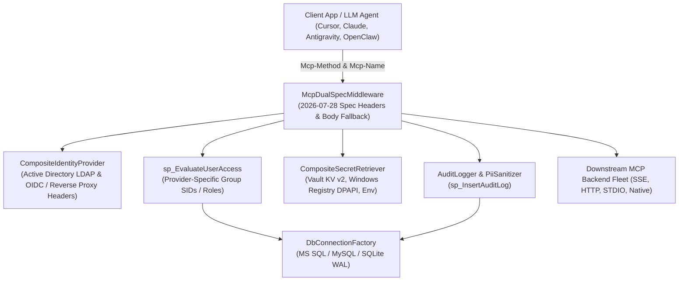
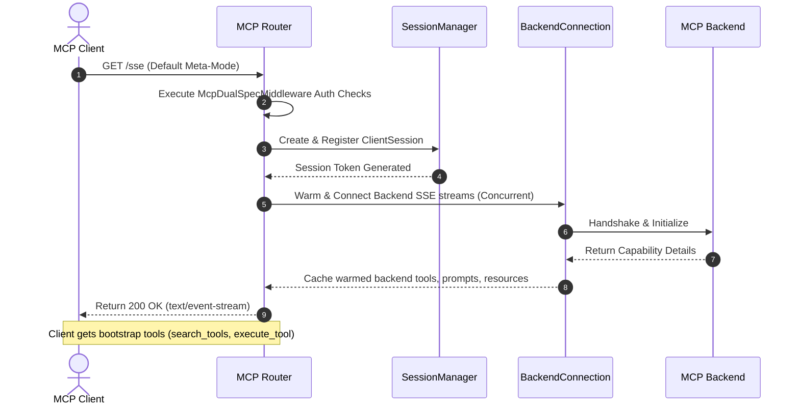
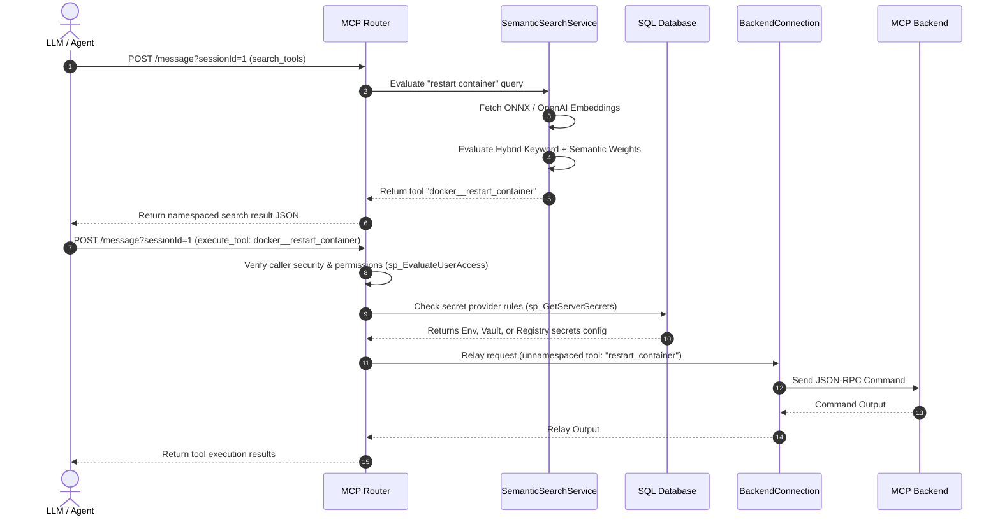

# 🏛️ MCP Router Architecture

This document provides an executive summary of the internal architecture, security mechanisms, design requirements, and key subsystem flows of the **Model Context Protocol (MCP) Router Gateway & Semantic Proxy**.

> 📖 **Definitive Specification**: For exhaustive architectural details, comprehensive Mermaid sequence diagrams, component models, entity-relationship diagrams (ERDs), and cryptographic specifications, see the [**Complete Enterprise Architecture Guide**](docs/architecture.md).

---

## 📐 Architectural Design Requirements

### 1. Performance & Latency Requirements
- **Sub-millisecond Routing Decision**: The gateway annotates request metadata based on headers (`Mcp-Method` and `Mcp-Name` compliant with the MCP 2026-07-28 Spec) without having to read or buffer the request body if present, enabling downstream components to inspect annotated metadata. Routing is ultimately body/path based.
- **Concurrent Request Handling**: Highly thread-safe design. The router manages simultaneous SSE client channels, background health probes, and on-demand semantic search requests using thread-safe state wrappers (`ConcurrentDictionary` and thread-safe locks).
- **Background Startup Warming**: Embedding models, backend connection channels, and configuration caches are preloaded asynchronously during server initialization (`ClientSession.BackendInitializer.cs`). This prevents first-request latency spikes (cold starts).

### 2. Security & Identity Requirements
- **Dual Authenticated Identities**: Supports enterprise-grade Windows/Kerberos environments via Active Directory SIDs (`LdapActiveDirectoryService.cs`) as well as modern containerized reverse-proxy identities via OIDC headers (`Remote-User`, `Remote-Groups`).
- **Granular AppKey Authorization**: Machine callers and autonomous agents authenticate via high-entropy AppKeys (`mcp-*-*-*`) with scope enforcement (`*`, `server:*`, `category:*`, `tool:*`).
- **Strict Role-Based Access Control (RBAC)**: Target servers and backend tools verify caller groups using database-backed stored procedures (`sp_EvaluateUserAccess`).
- **Compliant Error Handling & WWW-Authenticate Headers**: In accordance with the MCP 2026-07-28 Authorization specification, the gateway emits strict `WWW-Authenticate` challenge headers during `401 Unauthorized` and `403 Forbidden` states.
- **Data Redaction (PII)**: Any bearer tokens, credentials, API keys, or database passwords parsed in standard JSON-RPC communication are filtered and redacted (`PiiSanitizer.cs`) before being logged or stored.

### 3. Reliability & Resilience Requirements
- **Pluggable & Extensible Design**: Downstream transports (`ITransport`), identity providers (`IIdentityProvider`), secret managers (`ISecretRetriever`), and database providers (`IDbConnectionFactory`) are structured under clean strategy patterns.
- **Robust In-Flight Concurrency**: Uses `JsonRpcStateManager` with unique upstream GUID request rewriting and `PendingRequestTcs` to guarantee that out-of-order responses from multiplexed upstream servers are cleanly routed back to the exact requesting thread with their original client ID preserved.
- **Safe Resource Cleanup**: Active SSE client sessions handle connection terminations cleanly and capture cancellation tokens gracefully (`notifications/cancelled`).

---

## 🏛️ System Architecture Overview


```mermaid
graph TD
    Client["Client App / LLM Agent (Cursor, Claude, Antigravity, OpenClaw)"]
    Middleware["McpDualSpecMiddleware<br>(2026-07-28 Spec Headers & Body Fallback)"]
    Identity["CompositeIdentityProvider<br>(Active Directory LDAP & OIDC / Reverse Proxy Headers)"]
    AuthEvaluator["sp_EvaluateUserAccess<br>(Provider-Specific Group SIDs / Roles)"]
    Secrets["CompositeSecretRetriever<br>(Vault KV v2, Windows Registry DPAPI, Env)"]
    Audit["AuditLogger & PiiSanitizer<br>(sp_InsertAuditLog)"]
    DbFactory["DbConnectionFactory<br>(MS SQL / MySQL / SQLite WAL)"]
    Downstream["Downstream MCP Backend Fleet (SSE, HTTP, STDIO, Native)"]

    Client -->|Mcp-Method & Mcp-Name| Middleware
    Middleware --> Identity
    Middleware --> AuthEvaluator
    AuthEvaluator --> DbFactory
    Middleware --> Secrets
    Middleware --> Downstream
    Middleware --> Audit
    Audit --> DbFactory
```

### 📦 Modular Domain & Infrastructure Boundaries

The backend is organized into clear bounded modules across domain components, infrastructure, and core routing logic:

```text
├── Components/
│   ├── Servers/         # Upstream server models, validation, health checks, discovery & MapServerEndpoints
│   ├── Clients/         # Client models, credential services, OAuth & MapClientEndpoints
│   ├── AppKeys/         # AppKey models, authorization keys, hashing, scope validation & MapAppKeyEndpoints
│   ├── Providers/       # Auth/secret provider settings, AES-256-GCM crypto & MapProviderEndpoints
│   ├── Authorization/   # Access policies, group mappings, RBAC evaluation & MapPolicyEndpoints
│   └── Capabilities/    # Native tools, proxy execution, tool/prompt/resource handlers & MapCapabilityEndpoints
├── Infrastructure/
│   ├── Persistence/     # Dapper repositories, database connection factory, migrations & seeders
│   ├── Transports/      # SSE, HTTP, STDIO, JSON-RPC state manager & target proxy
│   ├── Identity/        # Active Directory, OIDC, AppKey identity providers & LDAP service
│   ├── Secrets/         # Vault, Windows Registry, Environment secret retrievers & encryption
│   └── Logging/         # Audit logger, PII sanitization & in-memory log providers
└── Core/
    ├── Protocol/        # JSON-RPC protocol models & Polymorphic converter
    └── Routing/         # ClientSession (partial classes), SessionManager, BackendConnection & Semantic Search
```

---

## 📡 Key Message & Connection Flows

### 1. SSE Client Connection & Meta-Mode Tool Discovery
When an MCP client initiates a connection to `/sse`:


```mermaid
sequenceDiagram
    autonumber
    actor Client as MCP Client
    participant Router as MCP Router
    participant SessionMgr as SessionManager
    participant BackendConn as BackendConnection
    participant Downstream as MCP Backend

    Client->>Router: GET /sse (Default Meta-Mode)
    Router->>Router: Execute McpDualSpecMiddleware Auth Checks
    Router->>SessionMgr: Create & Register ClientSession
    SessionMgr-->>Router: Session Token Generated
    Router->>BackendConn: Warm & Connect Backend SSE streams (Concurrent)
    BackendConn->>Downstream: Handshake & Initialize
    Downstream-->>BackendConn: Return Capability Details
    BackendConn-->>Router: Cache warmed backend tools, prompts, resources
    Router-->>Client: Return 200 OK (text/event-stream)
    Note over Client,Router: Client gets bootstrap tools (search_tools, execute_tool)
```

---

### 2. Request Routing and Execution Flow (Meta-Mode)
When an agent client searches for and executes a capability:


```mermaid
sequenceDiagram
    autonumber
    actor Client as LLM / Agent
    participant Router as MCP Router
    participant SemanticSvc as SemanticSearchService
    participant DB as SQL Database
    participant BackendConn as BackendConnection
    participant Downstream as MCP Backend

    Client->>Router: POST /message?sessionId=1 (search_tools)
    Router->>SemanticSvc: Evaluate "restart container" query
    SemanticSvc->>SemanticSvc: Fetch ONNX / OpenAI Embeddings
    SemanticSvc->>SemanticSvc: Evaluate Hybrid Keyword + Semantic Weights
    SemanticSvc-->>Router: Return tool "docker__restart_container"
    Router-->>Client: Return namespaced search result JSON

    Client->>Router: POST /message?sessionId=1 (execute_tool: docker__restart_container)
    Router->>Router: Verify caller security & permissions (sp_EvaluateUserAccess)
    Router->>DB: Check secret provider rules (sp_GetServerSecrets)
    DB-->>Router: Returns Env, Vault, or Registry secrets config
    Router->>BackendConn: Relay request (unnamespaced tool: "restart_container")
    BackendConn->>Downstream: Send JSON-RPC Command
    Downstream-->>BackendConn: Command Output
    BackendConn-->>Router: Relay Output
    Router-->>Client: Return tool execution results
```

---

## 🔒 4-Stage Authorization Pipeline

Every request entering the router passes through four concentric security boundaries:

```
┌─────────────────────────────────────────────────────────────────────────────┐
│ 1. AppKey Scope Boundary (Fast-Path Key Filtering)                          │
│    Does the caller's AppKey allow the target server, category, or tool?     │
└──────────────────────────────────────┬──────────────────────────────────────┘
                                       │ Pass
┌──────────────────────────────────────▼──────────────────────────────────────┐
│ 2. Identity Resolution & Group Mapping                                      │
│    Resolve username, external SIDs, and map them to internal groups         │
└──────────────────────────────────────┬──────────────────────────────────────┘
                                       │
┌──────────────────────────────────────▼──────────────────────────────────────┐
│ 3. Administrative Bypass Check                                              │
│    Does the caller possess the Admin SID (S-1-5-32-544 / full_admin)?       │
└──────────────────────────────────────┬──────────────────────────────────────┘
                   │ No                                   │ Yes (Admin Bypass)
┌──────────────────▼───────────────────┐        ┌─────────▼───────────────────┐
│ 4. RBAC Policy Evaluation            │        │ Authorized (200 OK)         │
│    - Explicit Deny overrides Allow   │        │ Invocation Audit Logged     │
│    - Category & Server inheritance   │        └─────────────────────────────┘
│    - Fail-Closed Default (DENY)      │
└──────────────────┬───────────────────┘
                   │ Allowed
┌──────────────────▼───────────────────┐
│ Authorized (200 OK)                  │
│ Invocation Audit Logged              │
└──────────────────────────────────────┘
```

---

## 🗄️ Database & Entity-Relationship Architecture

The persistence layer is built on pure **Dapper** with dialect-specific query and stored procedure mappings, supporting **SQLite (embedded/WAL)**, **Microsoft SQL Server (T-SQL stored procedure suite)**, and **MySQL 8.0+ (`p_` parameter bindings)**.

The data tier comprises 12 core tables governing servers, tool registries, multi-stage authorization policies, enterprise identity mappings, encrypted credentials, and tamper-resistant audit logs:

- **Server & Tool Fleet**: `Servers`, `Tools` (cascade deletion), and dynamic `Settings`.
- **Identity & Access Control**: `AdGroups`, `GroupMappings`, `AccessPolicies`, and `ToolAccessPolicies`.
- **Authentication & Secrets**: `AppKeys` (with `OwnerSid` attribution), `SecretProviders` (`EncryptedConfigJson`), and `AuthProviderConfigs` (`EncryptedConfigJson`).
- **Audit Logging**: `AuditLogs` and `AdminAuditLogs`.

> 📊 **Canonical Entity-Relationship Diagram (ERD)**:
> For the complete 12-table Mermaid ERD, column constraints, data types, and stored procedure suites, see the authoritative [**Database Provider Support & Deployment Matrix (`docs/database-providers.md`)**](docs/database-providers.md#unified-database-entity-relationship-diagram-erd).

---

## 📚 Architectural Guides & Specifications

For comprehensive guides covering each individual subsystem in depth, refer to the technical specification library:

| Specification Document | Focus Area |
| :--- | :--- |
| [**`docs/architecture.md`**](docs/architecture.md) | **Master Architectural Specification & Comprehensive Deep-Dive** |
| [**`docs/data-model.md`**](docs/data-model.md) | **Canonical Data Model & Database Entity-Relationship Diagram (ERD)** |
| [**`docs/transports.md`**](docs/transports.md) | Downstream Transports, Concurrency & Subprocess STDIO Lifecycle |
| [**`docs/appkey-scopes.md`**](docs/appkey-scopes.md) | AppKey Scopes, Granular Permissions & Multi-Stage Authorization |
| [**`docs/database-providers.md`**](docs/database-providers.md) | SQLite WAL, MS SQL Server & MySQL Stored Procedure Dialects |
| [**`docs/secret-providers.md`**](docs/secret-providers.md) | HashiCorp Vault, Windows Registry DPAPI & AES-256-GCM Crypto |
| [**`docs/ci-quality-gates.md`**](docs/ci-quality-gates.md) | Automated PR Quality Gates, Static Analysis & Testing Contracts |
| [**`docs/testing-matrix.md`**](docs/testing-matrix.md) | Pairwise Integration Matrix & Multi-User E2E Fixtures |
| [**`docs/evaluation-guide.md`**](docs/evaluation-guide.md) | Product Evaluation, Context Reduction & Gateway Comparison |
| [**`docs/developer-guide.md`**](docs/developer-guide.md) | Developer Setup, Coding Standards & Testing Protocols |
| [**`docs/runbook.md`**](docs/runbook.md) | Production Operations, Deployment, Backups & Disaster Recovery |

---

*Last Updated: Release `v4.13.0`*
