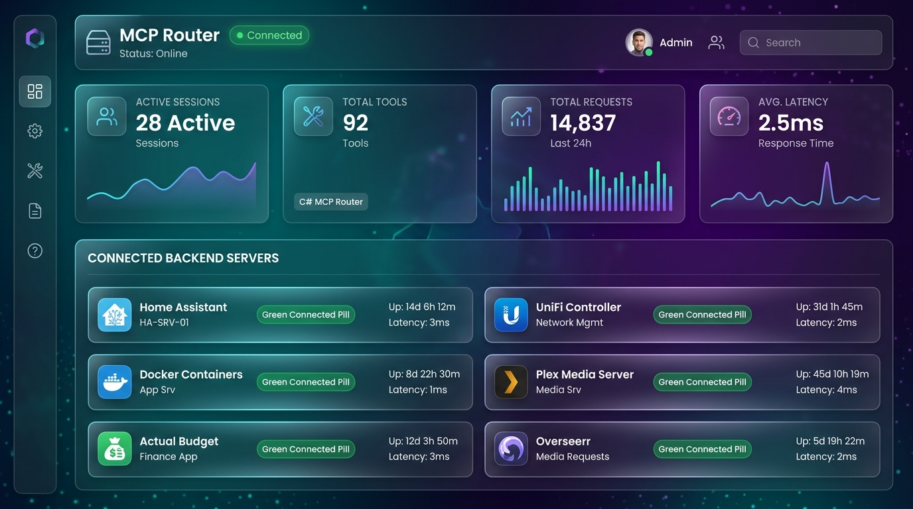
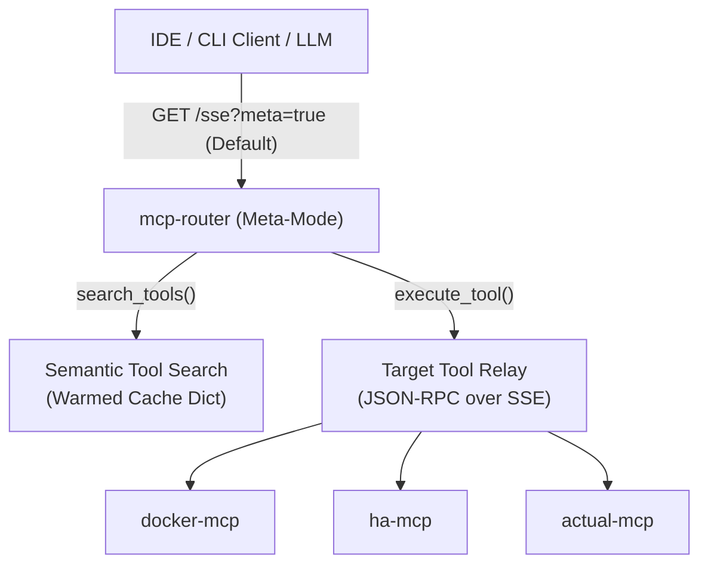
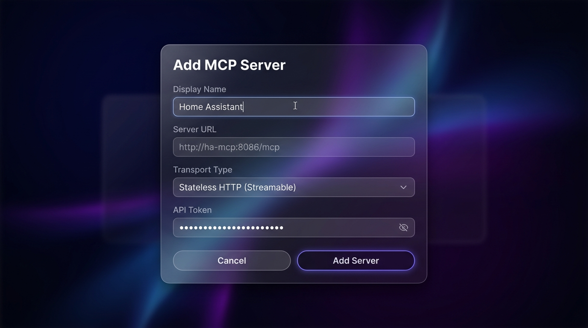
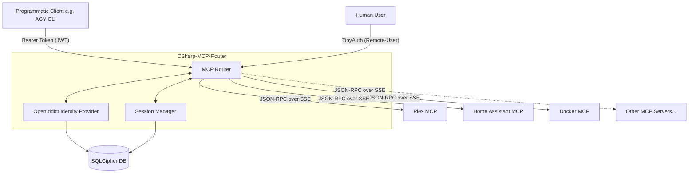

# MCP Router Gateway & Semantic Proxy

An enterprise-ready, high-performance C# ASP.NET Core gateway router, OAuth 2.0 provider, and semantic proxy for the **Model Context Protocol (MCP)**. 

The `mcp-router` aggregates multiple internal backend MCP servers (Docker, Plex, Home Assistant, Actual Budget, Excel, etc.) and presents them to client LLMs, IDEs, and agents as a single unified connection.



---

## 🌟 Key Features

* **Consolidated Tools Gateway:** Merges 300+ tools from dozens of isolated backend servers into a single endpoint.
* **Meta-Mode Dynamic Tool Filtering:** 
  * Defaults to Meta-Mode on the main `/sse` connection path to prevent context window bloat and tool confusion.
  * Instantly returns only two bootstrap tools: `search_tools` and `execute_tool`.
  * Asynchronously warms backend caches in the background using a thread-safe, single-execution initialization lock.
  * Performs semantic scoring and ranking of backend tools on-demand when `search_tools` is called.
* **Dual-Provider Semantic Search**:
  * **Local ONNX (In-Process)**: CPU-friendly vector embeddings using a local `all-MiniLM-L6-v2` model and `Microsoft.ML.Tokenizers` (no external APIs). Automatically downloads model/vocab files into persistent volumes.
  * **API Provider**: OpenAI-compatible embedding calls (LiteLLM, Open WebUI, OpenAI, etc.).
  * **Secure DB Storage**: Embedding configurations and API keys are stored securely inside the SQLCipher-encrypted SQLite database.
* **Developer Test Bench & Dashboard**: 
  * **Interactive UI**: Form builder renders interactive input controls directly from tools' JSON schema specs.
  * **Logs Console**: Styled real-time terminal rendering thread-safe in-memory gateway logs.
  * **Search Simulator**: Real-time evaluation panel for intent ranking.
* **Target-Specific Proxying:** Exposes separate endpoints (`/{targetServerId}`) to route directly to specific backends (e.g., `/plex`, `/docker`).
* **OAuth 2.0 Security:** Integrates a lightweight OAuth 2.0 authorization server for secure API access.
* **Built-in Web Dashboard:** A responsive, dark-mode, glassmorphic UI to monitor connected clients, stats, and backend health status.

---

## 🏗️ Architecture & Connection Flow

For deep technical details on the router's internal design, dependency injection, routing managers, and transport layers, see [ARCHITECTURE.md](ARCHITECTURE.md).

The gateway bridges incoming client HTTP requests to backend MCP transports:



---

## 📡 Supported Transports & Protocols

The MCP Router supports both legacy and modern transport implementations of the Model Context Protocol, automatically negotiating them based on server configuration:

1. **Server-Sent Events (SSE) (Stateful / Legacy)**:
   * Used by servers implementing the legacy SSE client-server model (e.g., establishing a GET connection to receive events and relaying POST commands via `/messages`).
   * Monitored asynchronously with active session tracking.

2. **Stateless Streamable HTTP (Modern MCP SDKs)**:
   * Native support for newer Node.js/Python SDK implementations that serve stateless endpoints (e.g., standard `FastMCP` or Hono-based packages).
   * **No-Hang Streaming Buffer**: Implements line-by-line stream reading (`ReadLineAsync`) on chunked `text/event-stream` responses. It breaks and returns the parsed JSON-RPC payload as soon as the first `data:` or `{` block is read, preventing connections from hanging indefinitely.
   * **Empty-Response Resilience**: Gracefully handles `202 Accepted` empty-body payloads for client-to-server notifications (like `notifications/initialized`), avoiding protocol deserialization crashes.

---

## 🚀 Setup & Usage

### 1. Configuration (`.env`)
Create a `.env` file in the root of the router directory:
```ini
DB_ENCRYPTION_KEY=your-sqlcipher-database-key
ROUTER_SECRET=your-oauth-router-secret
```

### 2. Run with Docker Compose
Add the router service to your `docker-compose.yaml` stack:
```yaml
services:
  mcp-router:
    build:
      context: ./router
    container_name: mcp-router
    ports:
      - "8026:8080"
    volumes:
      - ./router/data:/app/data
    env_file:
      - ./router/.env
    restart: unless-stopped
```

### 3. Connect a Client
Point your MCP client (Cursor, VS Code, or Claude Desktop) to the gateway:

#### Option A: Meta-Mode (Recommended - 2 Tools)
Keeps context windows clean by resolving tools semantically on-the-fly:
* **SSE Endpoint:** `http://10.0.0.10:8026/sse`

#### Option B: Full-List Mode
Exposes all 300+ underlying tools directly:
* **SSE Endpoint:** `http://10.0.0.10:8026/sse?meta=false`

#### Option C: Target-Specific Mode
Binds the connection to a single backend (e.g. Docker only):
* **SSE Endpoint:** `http://10.0.0.10:8026/docker`
* *Note: You can also pass `?meta=true` on target routes to filter them.*

#### Option D: Antigravity CLI (AGY)
To connect the Antigravity CLI, add the router configuration in the `.gemini/settings.json` file inside your workspace root:
```json
{
  "mcpServers": {
    "mcp-router": {
      "url": "http://10.0.0.10:8026/sse",
      "type": "sse",
      "trust": true,
      "serverUrl": "http://10.0.0.10:8026/sse"
    }
  }
}
```

---

## 🤖 Client Agent Integration Guidelines

When using agentic coding assistants (such as Antigravity/AGY) connected to this gateway, the agent should follow these core patterns:

1. **Bootstrap Search (Meta-Mode)**: By default, the gateway hides all underlying tools to prevent context bloat. The agent must first query `search_tools` with a natural language query describing the desired action (e.g., `"restart actual budget container"`).
2. **Namespaced Execution**: After `search_tools` returns matching namespaced tools (e.g. `docker__restart_container`), the agent must invoke it via `execute_tool(name, arguments)`.
3. **Semantic Knowledge Retrieval (`notes-rag`)**: AI agents **MUST** query the `notes-rag` service first (using the `search_notes` tool) for system architecture or setup questions before attempting to grep the filesystem. This leverages the local SilverBullet/Obsidian notes database.

---

## ⚙️ Adding & Managing Backend MCP Servers

The MCP Router supports three methods to add, update, and manage your backend MCP servers:

### Method A: Web UI Dashboard (Recommended)
You can manage servers dynamically on the fly without restarting the gateway:
1. Open the router dashboard in your browser.
2. Click the **+ Add Server** button in the top right.
3. Fill out the **Add MCP Server** modal (Display Name, URL, Transport Type, Category, and API tokens).
4. Click **Save Server** — the router automatically disconnects existing client sessions to warm up the new server connection.



---

### Method B: Static JSON Configuration (`custom_servers.json`)
For GitOps or automated deployments, you can seed servers via a JSON file. Create a `custom_servers.json` file inside the mapped `data/` volume directory:

```json
[
  {
    "id": "my-mcp-server",
    "displayName": "My Custom Server",
    "url": "http://10.0.0.15:3000/sse",
    "type": "sse",
    "category": "infrastructure",
    "enabled": true,
    "hidden": false,
    "apiKey": "optional-bearer-or-api-key",
    "headersJson": "{\"Custom-Header-Name\": \"Header-Value\"}"
  }
]
```
The router parses this file on startup, registering new servers or updating existing ones in the SQLCipher database.

---

### Method C: Environment Seed Migration
The gateway auto-seeds common homelab services on its first run if they are specified in the environment (e.g., `HOMEASSISTANT_TOKEN`, `PLEX_TOKEN`, `SEERR_API_KEY`). See [Program.cs](Program.cs) for details.

---

## 🛠️ API & Endpoint Specs

* `GET /sse` — Establishes client SSE event stream.
* `POST /message?sessionId={id}` — Relays incoming client JSON-RPC requests.
* `GET /{targetServerId}` — Proxies to a single backend server (e.g. `/ha`, `/plex`).
* `POST /oauth/token` — Exchange credentials for bearer authorization tokens.
* `GET /health` — Status healthcheck.

---

## 📡 Supported MCP Features

The router seamlessly aggregates the following MCP protocol features across all connected backends:

* **Tools** (`tools/list`, `tools/call`)
  * Tools from backends are automatically prefixed with the `serverId` (e.g. `docker__list_containers`).
  * In Meta-Mode, tools are hidden behind the semantic `search_tools` and `execute_tool` proxy layer.
* **Resources** (`resources/list`, `resources/read`)
  * URIs are safely mapped to unique virtual namespaces (e.g., `mcp://plex/resource_path`).
* **Prompts** (`prompts/list`, `prompts/get`)
  * Like tools, prompts are transparently prefixed and routed to the correct backend.
* **Notifications & Logging**
  * `logMessage`, `resourceUpdated`, and other backend notifications are asynchronously forwarded directly to connected clients in real time.


## Internal Architecture Diagram


