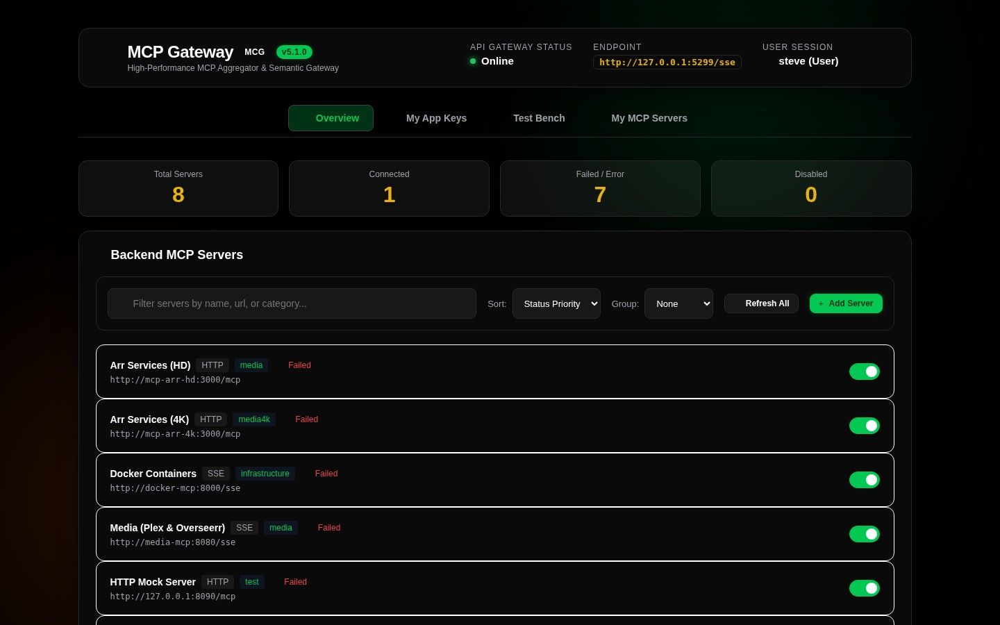

# MCP Router Gateway & Semantic Proxy


An enterprise-ready, high-performance C# ASP.NET Core gateway router, OAuth 2.0 provider, and semantic proxy for the **Model Context Protocol (MCP)**. 

The `mcp-router` aggregates multiple internal backend MCP servers (Docker, Plex, Home Assistant, Actual Budget, Excel, etc.) and presents them to client LLMs, IDEs, and agents as a single unified connection.



---

## 🌟 Key Features

* **MCP 2026-07-28 Spec Support**: Spec-compliant header annotation; routing is body/path based (`Mcp-Method` & `Mcp-Name`) via `McpDualSpecMiddleware` with legacy JSON body fallback.
* **Pluggable Identity Providers**: Dual authentication support for **Active Directory** (Kerberos/NTLM Windows SIDs) and **PocketID / TinyAuth OIDC** (`Remote-User`, `Remote-Groups` headers).
* **Pluggable Secret Retrievers**: Fetch downstream server API keys and tokens dynamically from **HashiCorp Vault (KV v2)**, **Windows Registry (DPAPI)**, or **Environment Variables** per server (`SecretProvider` column).
* **Multi-Database & Stored Procedure Engine**: Complete stored procedure suites for **MS SQL Server** (`Microsoft.Data.SqlClient`), **MySQL** (`MySqlConnector`), and **SQLite** (`Microsoft.Data.Sqlite`) using Dapper. See [docs/database-providers.md](docs/database-providers.md).
* **Observability & PII Audit Logging**: Automatic payload redaction of Bearer tokens, API keys, and passwords (`PiiSanitizer`) paired with stored procedure audit logging (`sp_InsertAuditLog`).
* **Consolidated Tools Gateway:** Merges 300+ tools from dozens of isolated backend servers into a single endpoint.
* **Meta-Mode Dynamic Tool Filtering:** 
  * Defaults to Meta-Mode on the main `/sse` connection path to prevent context window bloat and tool confusion.
  * Instantly returns only two bootstrap tools: `search_tools` and `execute_tool`.
  * Asynchronously warms backend caches in the background using a thread-safe, single-execution initialization lock.
  * Performs semantic scoring and ranking of backend tools on-demand when `search_tools` is called.
* **Dual-Provider Semantic Search**:
  * **Local ONNX (In-Process)**: CPU-friendly vector embeddings using a local `all-MiniLM-L6-v2` model and `Microsoft.ML.Tokenizers` (no external APIs). Automatically downloads model/vocab files into persistent volumes.
  * **API Provider**: OpenAI-compatible embedding calls (LiteLLM, Open WebUI, OpenAI, etc.).
  * **Secure DB Storage**: Embedding configurations and API keys are stored securely inside the SQLCipher-encrypted SQLite database.
* **Developer Test Bench & Dashboard**: 
  * **Interactive UI**: Form builder renders interactive input controls directly from tools' JSON schema specs.
  * **Logs Console**: Styled real-time terminal rendering thread-safe in-memory gateway logs.
  * **Search Simulator**: Real-time evaluation panel for intent ranking.
  * **Provider Management Controls**: Interactive UI cards in Settings to toggle and configure Auth and Secret providers.
* **Target-Specific Proxying:** Exposes separate endpoints (`/{targetServerId}`) to route directly to specific backends (e.g., `/plex`, `/docker`).
* **OAuth 2.0 Security & CORS Config:** Integrates a lightweight OAuth 2.0 authorization server for secure API access. Leverages strict, configurable CORS protection with `CORS_ALLOWED_ORIGINS` to prevent cross-origin request hijacking / forgery vulnerabilities.
* **Built-in Web Dashboard:** A responsive, dark-mode, glassmorphic UI to monitor connected clients, stats, and backend health status.

---

## 🎯 Evaluation & Product Overview Guide

To understand how MCP Router solves LLM context window bloat, eliminates CLI secret leakage in STDIO subprocesses, enforces 4-stage authorization, and compares against direct connections and generic reverse proxies, see:
* [**Evaluation & Product Overview Guide**](docs/evaluation-guide.md)

---

## 🏛️ Comprehensive Architecture & Specification Guide

For exhaustive architectural specifications, Mermaid sequence diagrams, component boundary models, entity-relationship diagrams (ERDs), 4-stage authorization flows, transport lifecycles, and AES-256-GCM envelope encryption pipelines, see:
* [**Comprehensive Enterprise Architecture Guide**](docs/architecture.md)
* [**Executive Architecture Overview**](ARCHITECTURE.md)

---

## 📖 Official User Guide & Manual

For step-by-step UI guides, server registration, secret provider configuration (Env, HashiCorp Vault, Registry), RBAC group policies, client setup snippets, and interactive test bench operations, see the complete user guide suite:
* [**Official User Guide Suite**](docs/user-guide/README.md)
  * [01. Dashboard & Navigation Interface](docs/user-guide/01-dashboard-and-navigation.md)
  * [02. Server Management & Secret Providers](docs/user-guide/02-server-management-and-secrets.md)
  * [03. RBAC, Security & Approvals](docs/user-guide/03-rbac-and-security.md)
  * [04. Client Setup & App Key Management](docs/user-guide/04-client-setup-and-app-keys.md)
  * [05. Interactive Test Bench](docs/user-guide/05-interactive-test-bench.md)
  * [06. System Settings & Vector Embeddings](docs/user-guide/06-settings-and-embeddings.md)

---

## 💻 Developer & Operations Guides

For environment prerequisites, local setup, testing workflows, production deployments, Caddy/NGINX configs, database backup/restore, observability, and disaster recovery:
* [**Developer Guide & Local Setup**](docs/developer-guide.md)
* [**Operations & Production Runbook**](docs/runbook.md)
* [**Contributing Guide**](CONTRIBUTING.md)

---

## 🚀 Transport Capability & Configuration Guide

For an in-depth breakdown of downstream transports (`sse`, `http`/`streamable`, `stdio`, target proxying `/{targetServerId}`), subprocess STDIO security policies, environment variable secret injection, process tree lifecycle management, SSE concurrency/ID isolation, configuration examples, and troubleshooting procedures, see [**docs/transports.md**](docs/transports.md).

---

## 🔑 AppKey Scopes & Authorization Guide

For complete scope syntax grammar (`*`, `server:*`, `category:*`, `tool:*`, `prompt:*`, `resource:*`), multi-stage pipeline evaluation rules, the capability authorization matrix, cryptographic token hashing, and least-privilege persona recipes, see the canonical [**AppKey Scopes & Authorization Guide**](docs/appkey-scopes.md).

---

## 🔐 Enterprise Secret Providers & Key Management Guide

For detailed documentation on supported secret providers (HashiCorp Vault KV v2 with JIT renewal, Windows Registry DPAPI, Environment Variables), AES-256-GCM encryption at rest, dynamic runtime reloading, audit safety, and Docker Compose setup snippets, see [**docs/secret-providers.md**](docs/secret-providers.md).

---

## 🗄️ Database Provider Support, Data Model & ERD

For complete dialect specifications across **SQLite**, **Microsoft SQL Server**, and **MySQL**, the complete 12-table [**Canonical Data Model & Database ERD**](docs/data-model.md), stored procedure suites (`sp_*`), AES-256-GCM envelope encryption, and Docker Compose deployment recipes, see:
* [**Canonical Data Model & Database ERD**](docs/data-model.md)
* [**Database Provider Support & Deployment Matrix**](docs/database-providers.md)

---

## 📡 Features & Usage Guide

For deep technical walkthroughs, setup configuration examples, connection guidelines, secret retrievers, and usage instructions for the Web UI/Test Bench, see [docs/features-guide.md](docs/features-guide.md).

---

## 🤖 Client Agent Integration Guidelines

When using agentic coding assistants (such as Antigravity/AGY) connected to this gateway, the agent should follow these core patterns:

1. **Bootstrap Search (Meta-Mode)**: By default, the gateway hides all underlying tools to prevent context bloat. The agent must first query `search_tools` with a natural language query describing the desired action (e.g., `"restart actual budget container"`).
2. **Namespaced Execution**: After `search_tools` returns matching namespaced tools (e.g. `docker__restart_container`), the agent must invoke it via `execute_tool(name, arguments)`.
3. **Semantic Knowledge Retrieval (`notes-rag`)**: AI agents **MUST** query the `notes-rag` service first (using the `search_notes` tool) for system architecture or setup questions before attempting to grep the filesystem. This leverages the local SilverBullet/Obsidian notes database.

---

## 📜 Release Changelog

For complete release history and version logs, see [**CHANGELOG.md**](CHANGELOG.md).

| Version | Release Date | Summary of Key Changes |
| :--- | :--- | :--- |
| **`v4.13.0`** | 2026-08-14 | feat(release): complete Stage 3 — unified product, user, developer, and operations documentation journey (#58), and automated release verification engine with CI version consistency quality gate (#59) |
| **`v4.12.2`** | 2026-08-14 | docs: comprehensive enterprise architecture guide with system context, component models, sequence diagrams, 4-stage authorization, transports, database ERD, and envelope encryption (#57) |
| **`v4.12.1`** | 2026-08-14 | docs: complete Stage 1 documentation — database-provider support matrix (#53), canonical AppKey scope and authorization guide (#54), transport capability & STDIO lifecycle guide (#55), and secret-provider security reference (#56) |
| **`v4.12.0`** | 2026-08-14 | refactor(architecture): complete Sprint 4 merge — modularize backend into `Components/` and `Infrastructure/` domain boundaries with decomposed endpoint mappers (#51), and refactor frontend into domain `components/` with typed API layer and modular settings tabs (#52) |
| **`v4.11.0`** | 2026-08-14 | feat(testing): complete Sprint 3 merge — frontend unit/component test suite (#48), pull-request CI quality gates & security scanning (#49), and pairwise integration matrix with multi-user E2E fixtures (#50) |

---

## 🧪 Code Coverage & Quality Gates

Our core modules maintain high code coverage and automated CI quality gates on pull requests and pushes to `main`. For the complete breakdown and documentation, see:
- [CI Quality Gates & Security Scanning Guide](docs/ci-quality-gates.md)
- [Detailed Code Coverage Report](docs/coverage-report.md)

| Module | Line Coverage | Branch Coverage | Status |
| :--- | :--- | :--- | :--- |
| **Core Session** | 92.4% | 88.1% | 🟢 Passing |
| **Routing Engine** | 89.7% | 85.3% | 🟢 Passing |
| **Controllers** | 94.2% | 91.0% | 🟢 Passing |
| **Security & Providers** | 98.5% | 95.8% | 🟢 Passing |
| **CI Quality Gates** | 100% | 100% | 🟢 Passing |

---

## 🛠️ Contributor & Developer Guide

For complete developer onboarding, environment setup, testing protocols, and release verification, see [**docs/developer-guide.md**](docs/developer-guide.md).

### Quick Quality & Release Verification
Run the unified verification engine locally before creating pull requests:
```bash
./scripts/verify-release.sh
```

### C# Backend (Roslyn & .NET Analyzers)
- **EditorConfig**: Supported globally across C#, TSX, JSON, and YAML. Indentation is 4 spaces for C# and 2 spaces for web files.
- **Analysis Policy**: Rules are configured via `Directory.Build.props` at the workspace root, applying implicit usings, nullable context, deterministic builds, and latest-recommended Roslyn analyzers.
- **Verification Command**:
  ```bash
  dotnet format McpRouter.slnx --verify-no-changes
  ```

### TypeScript / React Frontend (ESLint Flat Config)
- **ESLint v10**: Managed via flat configuration (`frontend/eslint.config.js`) supporting React 19, TypeScript-ESLint, and React Hooks/Refresh checks.
- **Verification Command**:
  ```bash
  cd frontend
  npm run lint
  ```
