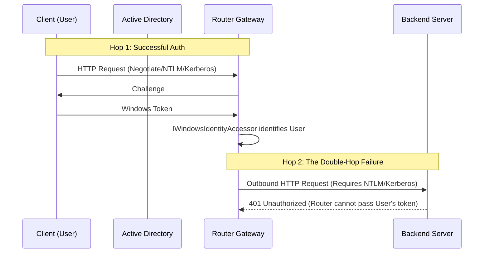
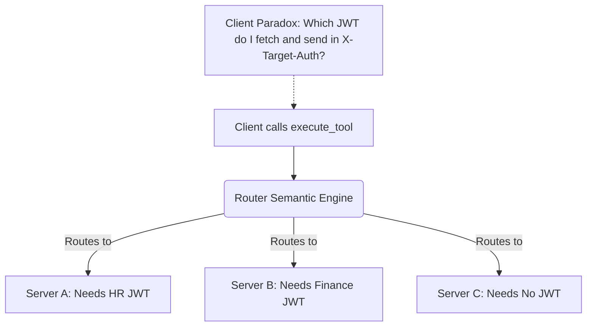

# Dynamic Auth & Kerberos Limitations

This document outlines fundamental architectural limitations when dealing with dynamic credentials (like short-lived JWTs) and Windows Integrated Authentication (Kerberos/NTLM) in the MCP Router.

## 1. The Kerberos "Double-Hop" Boundary

The gateway supports identifying incoming users via Windows Integrated Authentication (NTLM/Kerberos), but it **cannot** masquerade as the user to downstream MCP servers.

### Why this fails natively:
To solve the Double-Hop problem natively, the environment requires **Kerberos Constrained Delegation (S4U2Proxy)**. The Router's service account must be explicitly trusted in Active Directory to delegate credentials to the backend server's SPN (Service Principal Name).
Additionally, the Router's C# codebase would need to wrap outgoing requests in `WindowsIdentity.RunImpersonatedAsync()` and configure its `HttpClient` with `UseDefaultCredentials = true`, which it currently does not do. 
Therefore, the router acts strictly as a security boundary: it enforces RBAC at the edge but acts as a service account (or passes a static key) to the backend.

---

## 2. The Meta-Routing & Pass-Through Auth Paradox

While the router supports `AllowPassThroughAuth` (allowing clients to send a dynamic JWT via `X-Target-Auth`), this feature breaks down when combined with the router's core capability: **Semantic Meta-Routing**.

When the router operates in meta-mode, the client only sees universal tools (`search_tools`, `execute_tool`). The client has no idea *which* backend server will actually fulfill the request.

### The Problem
If Server A and Server B require different dynamic tokens from an internal Identity Provider, the client cannot pre-fetch the token because it doesn't know which server the Router will select. Furthermore, the Model Context Protocol (MCP) does not currently define a standard handshake for a server to pause execution, request a specific token from the client, and resume.

### Current Workarounds
1. **Targeted Proxy Routes**: If the client connects directly to a specific backend via the `/{targetServerId}` proxy route, it knows exactly which server it is talking to and can fetch the correct JWT.
2. **UserProvided Secret Store**: If the backend accepts a *static* user credential (like a Personal Access Token), the router can automatically look up the user's specific PAT from the database at runtime and inject it, completely solving the meta-routing paradox.
3. **Universal SSO Token**: The client fetches a single, universal JWT that all internal backends accept and passes it via `X-Target-Auth`.

---

## 3. The Enterprise Solution: Trusted Gateway Pattern

If an organization controls both the Router and the internal downstream MCP servers, the industry-standard architectural solution is the **Trusted Gateway Pattern**. This eliminates the need for dynamic JWTs or Kerberos Double-Hops entirely.

### How it Works
1. **Edge Authentication**: The Router fully authenticates the client (via AppKey, SSO, or LDAP) and establishes the user's identity.
2. **Service Account Auth**: The downstream backend server is configured to bypass standard JWT/Kerberos checks for requests originating from the Router. Instead, the backend trusts a highly secure, global Service Account API Key injected by the Router (fetched from Vault or Windows DPAPI).
3. **Identity Propagation**: The Router passes the authenticated user's identity to the backend via a trusted HTTP header (e.g., `X-Forwarded-User: DOMAIN\Steve`).

### How Downstream Servers Use the Forwarded User
When the downstream MCP server receives the request, it verifies the Service Account API Key. Once validated, it explicitly trusts the `X-Forwarded-User` header. The backend server uses this username to:
- **Enforce Fine-Grained RBAC**: Check if the specific user has permission to execute the requested tool or read specific files.
- **Audit Logging**: Record exactly which human or IDE initiated the action (e.g., *"Tool 'query_db' executed by DOMAIN\Steve via Gateway"*).
- **Row-Level Security**: Apply data filters based on the user's identity before returning results.

*(Note: While the Router natively supports injecting the Service Account keys today, natively injecting the `X-Forwarded-User` header based on the resolved session identity is a recommended future enhancement for the C# routing engine).*
