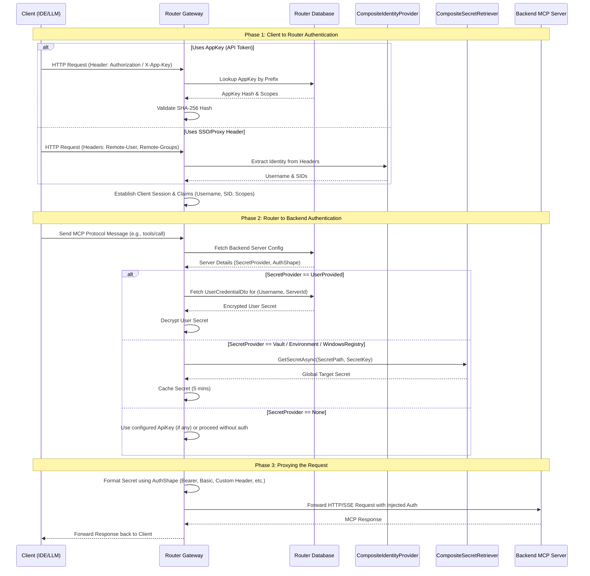

# MCP Request Auth End-to-End Flow

This diagram illustrates the complete, end-to-end authentication lifecycle of an MCP request passing from a Client, through the Router, to a backend MCP Server.

### Auth & Setup Matrix Reference
This flow highlights how the different matrices combine:
1. **Client Identity**: The router knows *who* is making the request (Username from SSO, or Username/OwnerSid from an AppKey).
2. **Server Auth Requirement**: The backend server expects a specific credential format (`AuthShape`).
3. **Secret Origin**: The router fulfills the backend's requirement by fetching a global secret (`Vault`, `Env`) OR a per-user secret (`UserProvided`), bridging the gap between the authenticated client and the target server transparently.

> [!WARNING]
> **Dynamic Token Limitation:** The gateway does not support *retrieving* dynamic tokens (like short-lived JWTs) from internal Auth endpoints on behalf of the user. All configured `SecretProviders` (including `UserProvided`) yield **static** credentials.
>
> If a backend requires a dynamic JWT with claims or timestamp checks, the client (IDE) must fetch the token itself and send it to the router using the `X-Target-Auth` header (provided `AllowPassThroughAuth` is enabled on the server config). The router will then format this token according to the backend's `AuthShape` (e.g., standard Bearer header) before forwarding the request.
