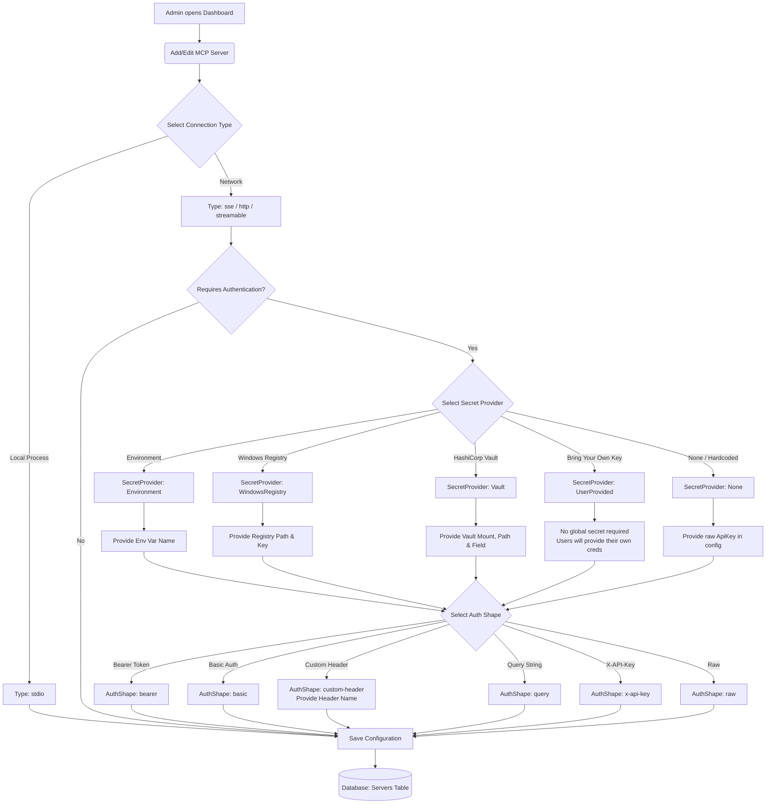

# MCP Server Configuration Flow

This document illustrates how an administrator configures a backend MCP Server in the Gateway, focusing on authentication and secret management.

### Explanation
1. **Connection Type**: The transport used to connect to the backend MCP server (e.g. `sse` for network, `stdio` for local binaries).
2. **Secret Provider**: Dictates where the router will fetch the credentials for this server at runtime.
    - **Environment**: Fetched from the router host's environment variables.
    - **WindowsRegistry**: Fetched from the router host's registry.
    - **Vault**: Fetched securely from a HashiCorp Vault instance.
    - **UserProvided**: The router will not use a global secret. Instead, it expects each platform user to have stored their own credentials in the `UserServerCredentials` table.
3. **Auth Shape**: Dictates how the fetched secret is injected into the HTTP request sent to the backend server (e.g., as a Bearer token in the Authorization header, or a custom HTTP header like `X-API-Key`).

### Note on Dynamic vs. Static Credentials
The Gateway is currently designed to fetch **static** secrets only (whether global via Vault/Env or user-specific via the Database). 

**The router does NOT natively support retrieving dynamic credentials** (such as negotiating an OAuth2/JWT token exchange with an internal identity provider on behalf of the user prior to calling the backend). 

If a backend server strictly requires a dynamic, short-lived JWT, the router cannot fetch it automatically. However, there is a workaround:
- **Pass-Through Auth**: An admin can enable `AllowPassThroughAuth` on the backend server. The *client* (IDE) must then retrieve the dynamic token itself and send it to the router in the `X-Target-Auth` HTTP header. The router extracts this token and seamlessly injects it into the outgoing backend request **using the configured `AuthShape`** (e.g., translating it into a standard `Authorization: Bearer <token>` header). The backend server remains completely unaware of the router's `X-Target-Auth` mechanism.
