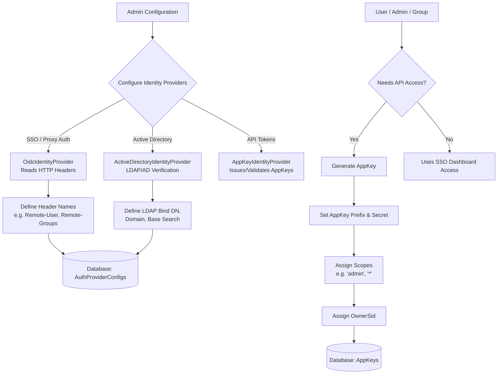

# Platform Configuration & User Setup Flow

This document illustrates how the MCP Router gateway is configured to authenticate incoming users (clients, IDEs, or human admins), and how `AppKeys` fit into the ecosystem.

### Explanation of AppKeys
AppKeys (or AppTokens) are persistent API keys used by external clients (like an IDE or an automated script) to authenticate against the MCP Router.

- **Prefix & Hash**: AppKeys consist of a public prefix (used for database lookup) and a secret portion (hashed via SHA-256 in the database). Format: `mcp-{scopeSlug}-{selector}-{secret}`.
- **Scopes**: Dictate permissions. A scope of `admin` or `*` grants the AppKey administrative privileges over the router configuration.
- **OwnerSid**: This is the "weird straggler" that provides group capability. An AppKey can be bound to a specific group's Security Identifier (SID). If an IDE connects using this AppKey, the router will associate the session with the group represented by the `OwnerSid`, allowing multiple users in a team to share a single service account AppKey while maintaining appropriate backend access control.
