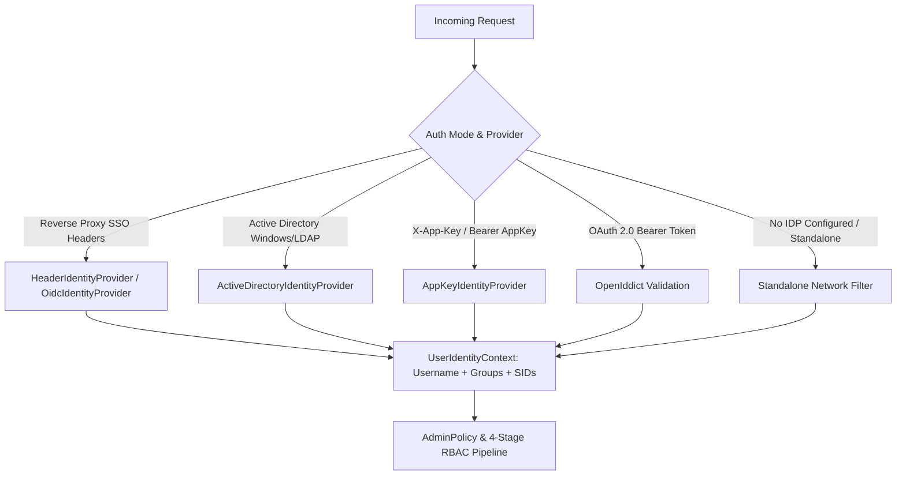

# Authentication & Authorization Architecture

This document outlines authentication and authorization in the MCP Router Gateway, detailing the separation between Active Directory (AD) Security Identifiers (SIDs), OIDC/Reverse Proxy headers, standalone network authorization, AppKeys, and the dedicated Admin MCP Server.

---

## 1. Identity Providers & Resolution

The router employs pluggable `IIdentityProvider` components wrapped by a `CompositeIdentityProvider` to resolve the `UserIdentityContext` from incoming HTTP requests.



### 1.1 Active Directory (`ActiveDirectoryIdentityProvider`)
- **Mechanism:** Utilizes native Windows Authentication (Kerberos/NTLM) or direct LDAP service binds.
- **Data Extraction:** Extracts the Windows username, Primary SID, and associated Group SIDs (e.g., `S-1-5-32-544`). Optionally queries domain LDAP trees recursively for nested groups.
- **Mapping:** Maps SIDs to the `UserIdentityContext.Sids` and `AllSids` collections.

### 1.2 OIDC / Header Proxy (`HeaderIdentityProvider` / `OidcIdentityProvider`)
- **Mechanism:** Processes HTTP headers injected by trusted upstream reverse proxies (e.g., PocketID, TinyAuth, Authentik, Keycloak, Authelia, Traefik, Caddy, Nginx).
- **Trust Validation:** Requires the upstream proxy remote IP to match `Oidc:TrustedProxies` (supports exact IPs and CIDRs). Untrusted requests have headers stripped and default to `guest`.
- **Data Parsing:** 
  - **User Headers:** Parses `Remote-User`, `X-Forwarded-User`, `X-Auth-Request-User`, `X-User`.
  - **Group Headers:** Parses headers like `Remote-Groups`, `sso_groups`, `X-Forwarded-Groups` into `GroupNames`. Supports comma-delimited strings and JSON array strings.
  - **SID Headers:** Parses explicit SID headers (e.g., `Remote-User-Sid`, `X-Auth-Request-Sid`) into the `Sids` collection.

### 1.3 AppKey Authentication (`AppKeyAuthenticationHandler`)
- **Mechanism:** Cryptographically verifies incoming API tokens (`mcp-...`) via constant-time SHA-256 hash comparison against stored hashes in the database.
- **Accepted Token Transports:**
  - `Authorization: Bearer mcp-...`
  - `X-App-Key: mcp-...` or `X-Api-Key: mcp-...`
  - URL Query parameter: `?app_key=mcp-...` or `?api_key=mcp-...`
- **Scope Verification:**
  - `all` or `*`: Grants full access across all tools, prompts, resources, and administrative endpoints.
  - `admin`: Grants administrative role (`ClaimTypes.Role: Administrator`).
  - `category:<name>`: Scoped strictly to servers carrying that category tag.

---

## 2. Standalone Mode & Local Network Authorization

When **NO external authentication provider** (Active Directory LDAP or OIDC SSO) is configured, the gateway automatically operates in **Standalone / Personal Mode**:

```
                       [ Incoming Request in Standalone Mode ]
                                         │
                   ┌─────────────────────┴─────────────────────┐
                   ▼                                           ▼
       [ Client IP in StandaloneAllowedNetworks? ]   [ Valid Admin AppKey Presented? ]
       (default: 127.0.0.1, ::1;                     (scopes: ["admin"], ["all"])
        custom LAN CIDRs or "0.0.0.0/0")                       │
                   │                                           │
                  YES ──► Grant Local Admin Access            YES ──► Grant Admin Access
                   │                                           │
                   NO ─────────────────────────────────────────NO ──► 403 Forbidden
```

### Configuration (`Admin:StandaloneAllowedNetworks`)
* **Default:** `["127.0.0.1", "::1"]` (Loopback only).
* **Private Subnet Example:** `["127.0.0.1", "::1", "10.0.0.0/8", "192.168.0.0/16", "172.16.0.0/12"]`.
* **Central LAN Open Mode:** `["0.0.0.0/0"]` (Permits any LAN host direct administration in private networks).

---

## 3. Administrative Authorization (`AdminPolicy`)

`AdminPolicy` secures management API endpoints (`/api/*`) and the dedicated Admin MCP Server (`/admin`, `/admin/sse`, `/router-admin`). Access is granted if any of the following conditions are met:

1. **Active Directory SID Match:** User's SIDs contain `Admin:GroupSid` (default: `S-1-5-32-544` / Local Administrators).
2. **OIDC Group Match:** User's `GroupNames` contain `Admin:GroupName` or match any entry in `Admin:Groups` (defaults: `full_admin`, `Administrator`, `Administrators`).
3. **Database Group Mappings:** Dynamic mapping in the `GroupMappings` database table maps an external SSO group ID to an admin group or SID.
4. **Admin AppKey:** The request presents an AppKey with `admin`, `*`, or `all` scope owned by an administrator.
5. **Standalone Network Match:** When no external IDP is active, the caller's IP matches `Admin:StandaloneAllowedNetworks`.

---

## 4. Admin MCP Server Architecture

Agentic platforms and LLM tools (Claude Desktop, Cursor, Cline, Windsurf) can administer the gateway via the native Admin MCP Server:

* **Endpoints:**
  * `GET/POST /admin` & `GET/POST /admin/sse`: MCP Server-Sent Events stream.
  * `POST /admin/message`: JSON-RPC 2.0 message handler.
  * `/{targetServerId}` (`/router-admin` or `/admin`): Target proxy alias.
* **10 Consolidated Tools:**
  1. `manage_servers`: Add, update, delete, enable/disable, and reconnect downstream MCP servers.
  2. `manage_appkeys`: Create, list, inspect limits, and revoke AppKeys.
  3. `manage_clients`: Register, list, and delete dynamic OAuth clients.
  4. `manage_policies`: Configure fine-grained RBAC access policies.
  5. `manage_group_mappings`: Map external SSO groups to internal roles.
  6. `manage_providers`: Configure and test secret stores (Vault, WinReg, Env) and auth providers (AD, OIDC).
  7. `manage_settings`: Update dashboard branding and semantic embedding providers.
  8. `manage_custom_files`: Manage local prompt and resource files in `data/`.
  9. `manage_system`: Inspect runtime diagnostics, view/clear logs, and query audit logs.
  10. `test_tool_call`: Test direct tool execution on downstream servers.
* **Audit Logging:** Every tool call automatically records caller, tool name, action, parameters (redacted), and outcome to the persistent `AuditLogs` store.

---

## 5. Configuration Reference

```json
{
  "Admin": {
    "GroupSid": "S-1-5-32-544",
    "GroupName": "full_admin",
    "Groups": [
      "full_admin",
      "Administrator",
      "Administrators",
      "Domain Admins"
    ],
    "StandaloneAllowedNetworks": [
      "127.0.0.1",
      "::1",
      "10.0.0.0/8",
      "192.168.0.0/16"
    ]
  },
  "Oidc": {
    "TrustedProxies": "10.0.5.10,172.17.0.1",
    "RequireTrustedProxy": true
  },
  "Identity": {
    "HeaderAuth": {
      "UserHeaders": [
        "Remote-User",
        "X-Forwarded-User"
      ],
      "GroupHeaders": [
        "Remote-Groups",
        "X-Forwarded-Groups",
        "sso_groups"
      ]
    }
  }
}
```

### Environment Variable Equivalents
* `Admin__GroupSid="S-1-5-32-544"`
* `Admin__GroupName="full_admin"`
* `Admin__Groups__0="full_admin"`
* `Admin__Groups__1="Administrator"`
* `Admin__Groups__2="Domain Admins"`
* `Admin__StandaloneAllowedNetworks__0="127.0.0.1"`
* `Admin__StandaloneAllowedNetworks__1="::1"`
* `Admin__StandaloneAllowedNetworks__2="10.0.0.0/8"`
* `Oidc__TrustedProxies="10.0.5.10,172.17.0.1"`
* `Oidc__RequireTrustedProxy="true"`


