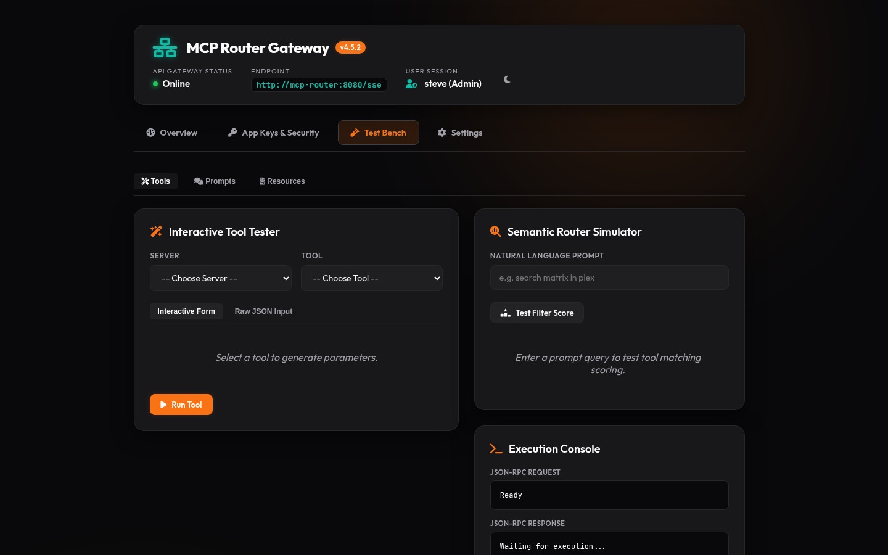

# MCP Router Features Guide

This guide provides in-depth instructions for using the various features of the MCP Router.

---

## 🖥️ 1. Dynamic Server Management

The MCP Router supports three methods to add, update, and manage backend Model Context Protocol (MCP) servers:

### Method A: Web UI Dashboard (Recommended)
You can manage servers dynamically on the fly without restarting the gateway:
1. Open the router dashboard in your browser.
2. Click the **+ Add Server** button in the top right.
3. Fill out the **Add MCP Server** modal:
   - **Display Name**: User-friendly label (e.g., `Home Assistant`).
   - **URL**: The backend SSE message endpoint or HTTP server (e.g., `http://ha-mcp:8086/mcp`).
   - **Transport Type**: Select `sse` (stateful) or `http` (stateless).
   - **Category**: Classify your server (e.g., `homecontrol`, `infrastructure`, `development`).
   - **API Token/Key**: Credentials needed to invoke downstream tools (saved securely).
   - **Secret Provider**: Choose how to retrieve server secrets dynamically (`None`, `Vault`, `WindowsRegistry`, or `Environment`). See the [Pluggable Secret Retrievers](#5-pluggable-secret-retrievers) section for setup details.
4. Click **Save Server**. The router automatically registers the server and warms up the background connections.


### Method B: Static JSON Seeding (`custom_servers.json`)
For GitOps, declarative configurations, or automated environments:
1. Create a `custom_servers.json` file inside the mapped `/app/data/` volume directory.
2. Structure the JSON as follows:
   ```json
   [
     {
       "id": "my-mcp-server",
       "displayName": "My Custom Server",
       "url": "http://10.0.0.15:3000/sse",
       "type": "sse",
       "category": "infrastructure",
       "enabled": true,
       "hidden": false,
       "apiKey": "optional-bearer-or-api-key",
       "headersJson": "{\"Custom-Header-Name\": \"Header-Value\"}"
     }
   ]
   ```
3. The gateway scans, inserts, or updates matching server entries in the local database during startup initialization.

### Method C: Environment Seed Migration
The gateway auto-seeds common homelab services on its first run if they are specified in the environment (e.g., `HOMEASSISTANT_TOKEN`, `PLEX_TOKEN`, `SEERR_API_KEY`). See `Program.cs` for details.

---

## 📡 2. Routing Modes

You can connect your client (Cursor, VS Code, Claude Desktop, Antigravity CLI) via different SSE connection endpoints:

| Route Path | Mode | Description |
| :--- | :--- | :--- |
| `/sse` or `/sse?meta=true` | **Meta-Mode (Default)** | Hides underlying tools from the initial bootstrap, offering only `search_tools` and `execute_tool`. Prevents context window bloat. |
| `/sse?meta=false` | **Full-List Mode** | Directly exposes all underlying tools (300+) from every connected backend server. |
| `/{targetServerId}` | **Target-Specific Proxying** | Bridges connections directly and exclusively to the target server (e.g., `/docker` or `/ha`). |

> For a complete comparison of transport protocols (`sse`, `http`, `stdio`, target proxying), concurrency isolation, security policies, and error recovery, see the [**Transport Capability & Configuration Guide**](transports.md).

### Client Setup Examples

#### Claude Desktop Configuration (`config.json`)
```json
{
  "mcpServers": {
    "mcp-router-meta": {
      "command": "npx",
      "args": ["-y", "@modelcontextprotocol/client-sse", "http://localhost:8026/sse"]
    }
  }
}
```

#### Antigravity CLI Configuration (`.gemini/settings.json`)
```json
{
  "mcpServers": {
    "mcp-router": {
      "url": "http://localhost:8026/sse",
      "type": "sse",
      "trust": true,
      "serverUrl": "http://localhost:8026/sse"
    }
  }
}
```

---

## 🔍 3. Semantic Search

When running in **Meta-Mode**, the router shields the client's context window. The client agent must query tools semantically first.

### Search Flow:
1. **Tool Inquiry**: Client queries `search_tools(query: "restart actual budget container")`.
2. **Hybrid Scoring Engine**:
   - Compares the semantic embeddings of underlying tools using either a **Local ONNX model** (`all-MiniLM-L6-v2`) or **LiteLLM/OpenAI-compatible APIs**.
   - Leverages **Keyword Boosting** (exact matching phrases get +2.0 weight boost, individual words +1.0/+0.5 boost).
3. **Execution Routing**: Once namespaced tool names (e.g., `docker__restart_container`) are returned, the client invokes them using `execute_tool`.

### Embeddings Configuration:
Through the Settings panel, you can choose:
* **Local ONNX (In-Process)**: CPU-friendly, offline, runs using `Microsoft.ML.OnnxRuntime`. Downloads ONNX weights on first run to the `/app/data/` volume.
* **OpenAI API / LiteLLM Provider**: Connects to remote endpoint models. Credentials are encrypted inside the database via SQLite SQLCipher.

---

## 🔐 4. Authentication, Group Mapping & Unified MCP Capability Authorization

The MCP Router enforces a **Unified Authorization Pipeline** across all Model Context Protocol capabilities:
- **Tools**: `tools/list`, `tools/call`
- **Prompts**: `prompts/list`, `prompts/get`
- **Resources**: `resources/list`, `resources/read`
- **Resource Templates**: `resources/templates/list`
- **Completions**: `completion/complete` (prompt & resource references)

Every request evaluates against the identical authorization pipeline:
1. **AppKey Scope Validation**: Checks key scopes (`*`, `all`, `server:{id}`, `tool:{id}`, `prompt:{id}`, `resource:{id}`, `resource_template:{id}`, `completion:{id}`).
2. **Admin SID Bypass**: Evaluates caller SIDs against `Admin:GroupSid` (e.g. `S-1-5-32-544`).
3. **Database Access Policies & Group Mapping**: Evaluates explicit allows and denies in `AccessPolicies` table / `sp_EvaluateUserAccess` stored procedure with mapped external groups/SIDs.
4. **Discovery Filtering**: Discovery list endpoints (`tools/list`, `prompts/list`, `resources/list`, `resources/templates/list`) automatically filter out unauthorized items.
5. **Fail-Closed Default**: Unknown capability types or unresolved target backends fail closed with audited 403 entries without leaking sensitive payloads.

### Dual Identity Providers
- **Active Directory (Kerberos/NTLM)**: Resolves caller identities using standard Active Directory SIDs (`WindowsIdentity`).
- **OIDC Header Proxy (PocketID / TinyAuth)**: Extracts SSO-managed HTTP headers (e.g., `Remote-User`, `Remote-Groups`).

### Group & SID Mapping Policy
External groups are mapped to virtual internal groups via the database `GroupMappings` table (accessible through the Web Dashboard UI under Settings -> Identity & Auth):
1. **Create Mapping**: Link an external Active Directory SID (e.g., `S-1-5-21-...`) or OIDC group (e.g., `house_member`) to an internal security group (`admin`, `operator`, `readonly`).
2. **Evaluate Access**: When any capability is invoked or listed, the router executes access evaluation to verify that the active user's groups permit invoking that specific namespace / target item / target server.

### AppKey Credentials & Category-Scoped Authorization
The router supports fine-grained, scoped AppKeys and Machine Client credentials for automated agents, IDE extensions, and services:
- **Scope Granularity**:
  - `all` or `*` or `mcp_client`: Full access across all backend servers and tools.
  - `server:<serverId>` or `<serverId>`: Direct access to all capabilities of a specific backend server.
  - `category:<name>` or `group:<name>`: Authorizes all tools, prompts, resources, templates, completions, and target-specific proxying for any server currently belonging to that category (evaluated dynamically from the database).
  - `tool:<name>`, `prompt:<name>`, `resource:<uri>`: Pinpoint access to single capabilities.
- **Dynamic Membership**: Category scopes evaluate server memberships in real time from the database. Adding or removing a category from a server takes effect immediately without needing to re-issue or recreate keys.
- **Creation Validation**: When creating AppKeys or Client credentials, `category:<name>` scopes are validated against registered server categories. Unknown or empty categories are rejected (400 Bad Request) unless provisioned by an administrator.

For complete scope syntax rules, multi-stage evaluation pipelines, cryptographic hashing, and persona configuration recipes, see the canonical [**AppKey Scopes & Authorization Guide**](appkey-scopes.md).

### CORS & Cross-Origin Security Configuration
By default, the gateway restricts cross-origin request access to standard safe localhost development origins (`http://localhost:3000`, `http://localhost:5000`, `https://localhost:5001`) to protect your local environment from cross-site request forgery and malicious third-party websites.

For production or custom domain deployments, you can configure the allowed origins using the `CORS_ALLOWED_ORIGINS` (or `AllowedOrigins`) environment variable or configuration setting:
- **`CORS_ALLOWED_ORIGINS`**: A comma, semicolon, or whitespace-separated list of allowed origin URLs (e.g., `https://my-mcp-dashboard.internal, https://cursor-plugin.internal`).

---

## 🔑 5. Pluggable Secret Retrievers

To avoid storing sensitive downstream API keys and passwords in plaintext database columns, the router dynamically fetches secrets at routing time via pluggable retrievers.

The `CompositeSecretRetriever` dynamically resolves secrets from:
1. **HashiCorp Vault (KV v2)**: Fetches secrets using path-based configurations (e.g., `/secret/data/mcp/plex`) with AppRole/Token auth and JIT token renewal.
2. **Windows Registry (DPAPI)**: Retrieves DPAPI-secured strings stored in the machine registry hives (`HKLM`).
3. **Environment Variables**: Resolves secrets bound as container environment variables on-demand (`env:MY_SECRET`).

> [!TIP]
> For complete configuration recipes, AppRole policies, AES-256-GCM encryption-at-rest key derivation, and troubleshooting guide, see [**docs/secret-providers.md**](secret-providers.md).

### Configuration
1. Register the secret location in your secret store (e.g., standard Environment Variable `DOCKER_API_KEY=my-super-secret`).
2. In the Add/Edit Server modal, select `Environment` for the **Secret Provider** column and specify `DOCKER_API_KEY` in the **SecretItemKey** field.
3. The gateway fetches, decrypts, and caches (using `IMemoryCache` with rolling TTL to support rotation) the token at execution time without leaking it in database backups.

---

## 🧪 6. Developer Test Bench & Diagnostics

The Web Dashboard features a robust developer environment to debug, simulate, and verify your gateway setup:

1. **Interactive Form Builder**: Generates responsive, customized forms matching the exact JSON schema specifications of any registered backend tool.
2. **Logs Console**: A thread-safe, styling-rich real-time console mirroring incoming JSON-RPC traffic, request IDs, and security classifications.
3. **Search Simulator**: Real-time evaluation panel where developers can test queries against the semantic search engine and inspect exact scores.
4. **Manual Approval Modal**: If "Manual Approval for Dangerous Tools" is toggled, dangerous executions pause, triggering an approval card on the Web UI awaiting administrator click.



---

## 🗄️ 7. Database Engine Support & Deployment

For complete dialect specifications across SQLite, Microsoft SQL Server, and MySQL, the complete 12-table [**Entity-Relationship Diagram (ERD)**](database-providers.md#unified-database-entity-relationship-diagram-erd), stored procedure catalogs, AES-256-GCM envelope encryption architecture, and production Docker Compose configurations, see [**Database Provider Support & Deployment Matrix**](database-providers.md).
