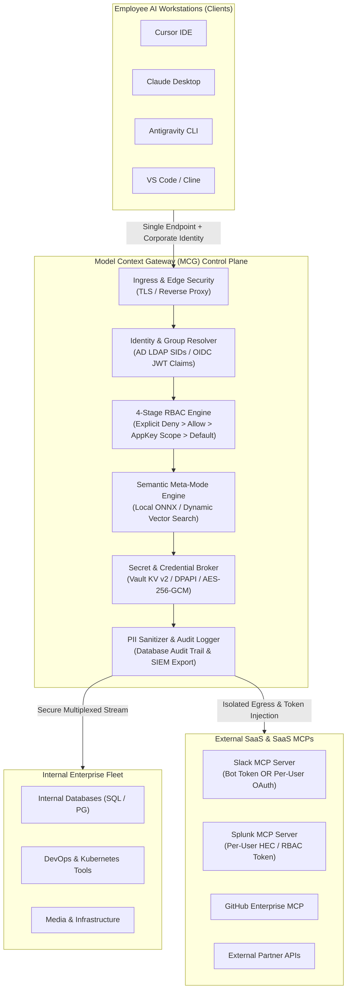
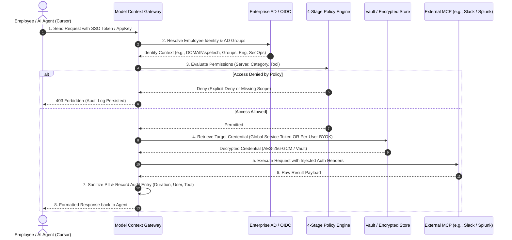
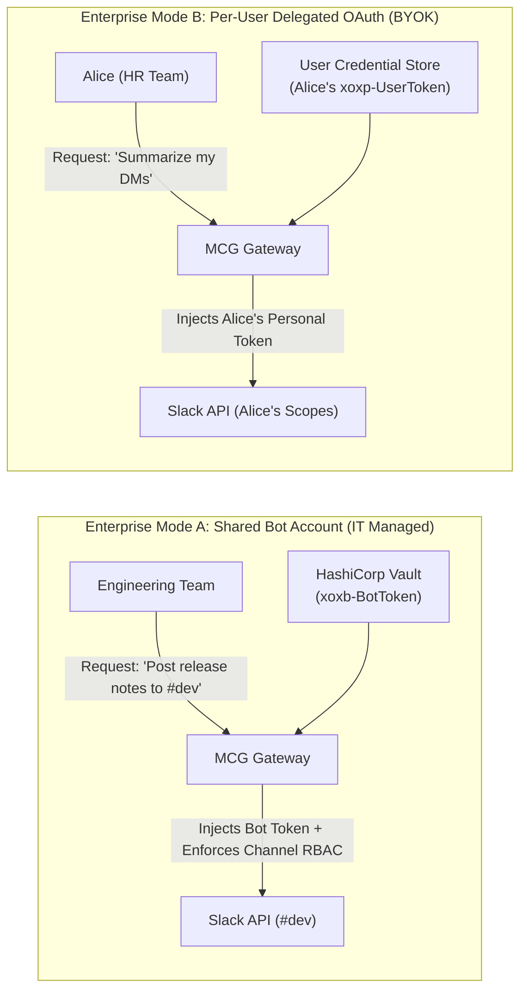
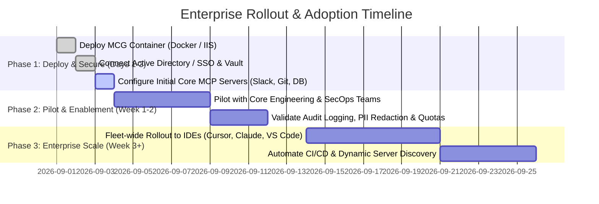

# Model Context Gateway (MCG): Enterprise Control Plane & Pitch Deck

---

## 🎯 Executive Summary & Value Proposition

Connecting AI coding assistants (Cursor, Claude Desktop, Antigravity, VS Code) and autonomous agent workflows to internal enterprise services and external SaaS APIs introduces severe security, governance, and operational bottlenecks. 

**Model Context Gateway (MCG)** provides a hardened, centralized proxy and authorization control plane for the **Model Context Protocol (MCP)**.

```
+---------------------------------------------------------------------------------------------------------+
|                                    BUSINESS VALUE & ROI SUMMARY                                         |
+---------------------------------------------------------------------------------------------------------+
|  💰 Cost & Latency Reduction   | 90%+ drop in prompt token overhead via Semantic Meta-Mode              |
|                                | (< 450 tokens vs. 30,000–60,000 tokens per prompt across 20+ servers)  |
|  🛡️ Zero-Trust Security        | Eliminate plaintext API keys on employee laptops; enforce AD/SSO RBAC  |
|  ⏱️ Fast Time to Value (TTV)  | Turnkey Docker deployment; integrate existing IDEs (Cursor/Claude/AGY) |
|                                | and Active Directory in under 1 day with zero custom client software   |
|  📈 Centralized Governance     | Unified PII-redacted audit logs; full visibility into which employee   |
|                                | or AI agent executed which tool, with what data, and when              |
+---------------------------------------------------------------------------------------------------------+
```

---

## 1. The Core Enterprise Challenges

As organizations scale their adoption of LLMs and autonomous agents:

1. **Context Window Bloat & Cost Explosion**: Exposing an LLM directly to 10–20 MCP servers injects 100–300+ tool JSON schemas into *every prompt*. This consumes 30,000–60,000+ tokens continuously, driving up inference latency, API costs, and model hallucination rates.
2. **Absence of Centralized RBAC**: Standalone MCP servers lack fine-grained authorization. Direct connections give all clients root/admin capabilities without Active Directory (AD) or SSO role boundaries.
3. **Secret Leakage & Command-Line Exposure**: Local STDIO MCP tools frequently require API tokens in command-line arguments, exposing sensitive credentials in process lists (`ps aux`) and unencrypted local config files.
4. **Zero Governance & Audit Blindspots**: Fragmented client-to-server connections leave security teams with no unified audit log of which employee invoked which internal tool.

---

## 2. High-Level Architecture & Subsystems

### System Context Block Diagram



---

## 3. Request Lifecycle & Subsystem Execution Flow



---

## 4. Key Design & Leadership Q&A

### Q1: How does this allow us to safely connect employees to external MCP servers?
* **Isolation Boundary**: Employees never establish direct, unmonitored connections to external endpoints from their machines.
* **Credential Shielding**: Third-party API keys and corporate tokens are stored centrally (Vault, DPAPI, or AES-256-GCM encrypted database). Employees invoke tools without ever possessing or seeing the underlying API tokens.
* **Egress & SSRF Protection**: The gateway enforces strict egress IP/subnet validation, preventing agents from making unauthorized SSRF queries.
* **Zero Command-Line Leakage**: For local STDIO subprocesses, secrets are injected exclusively into process environment dictionaries—never in command-line arguments visible in `ps aux` or OS process tables.

### Q2: How do we secure each user's auth and integrate with our existing auth systems?
* **Inbound Security**: Ingests enterprise identity from Active Directory (Windows SIDs), OIDC reverse proxy headers (`Remote-User`, `Remote-Groups`), or cryptographically generated high-entropy AppKeys (`mcp-*-*-*`).
* **Outbound Security**: Bridges the employee's corporate identity to the backend server using configured auth shapes (Bearer, Basic Auth, Custom Headers, or User-Specific BYOK).
* **Authenticated Envelope Encryption**: All credentials and configuration settings are protected at rest with AES-256-GCM (128-bit integrity tag, 96-bit IV) or dynamically managed via HashiCorp Vault.

### Q3: How well can we integrate with existing AD and JWT auth systems?
* **Active Directory / Kerberos**: Native LDAP integration automatically queries Active Directory to resolve caller SIDs and security group memberships (e.g., `DOMAIN\DevEngineers`, `S-1-5-32-544`).
* **JWT & OIDC Providers**: Turnkey compatibility with Authentik, Keycloak, Microsoft Entra ID, Okta, and Cloudflare Access via standard OIDC token claims and proxy headers.
* **Dynamic Group Mappings**: AD security groups and JWT roles map directly to gateway access policies. Updating group membership in AD immediately updates the user's MCP permissions with zero manual intervention.

### Q4: How can we track usage and limit users to specific servers?
* **4-Stage Multi-Tenant RBAC**:
  1. *Explicit Deny*: Overrides all allows (e.g. block contractors from `prod-db` or `finance-tools`).
  2. *Explicit Allow*: Grants server/tool categories to specific AD groups.
  3. *AppKey Scopes*: Restricts tokens to granular capabilities (`*`, `category:analytics`, `server:splunk`, `tool:docker__ps`).
  4. *Default Policy*: Configurable enterprise fail-closed security barrier.
* **User Quotas & Rate Limiting**: Enforces maximum key limits and per-user invocation quotas to prevent runaway agent loops or runaway API billing.
* **Granular Usage Attribution**: Logs every invocation with caller identity, timestamp, duration, and target tool.

### Q5: Does this scale well?
* **High-Throughput C# .NET 10 Engine**: Built on ASP.NET Core Kestrel with asynchronous non-blocking I/O, capable of processing tens of thousands of concurrent SSE and HTTP multiplexed streams with sub-millisecond routing latency.
* **Stateless Horizontal Scaling**: Gateway nodes are stateless. Multiple instances can run behind standard enterprise load balancers (AWS ALB, F5, Cloudflare, Nginx) connected to a shared database (Microsoft SQL Server, MySQL, SQLite) and HashiCorp Vault.
* **Context Window Scalability (Meta-Mode)**: Traditional setups inject 100–300 tool schemas into every prompt (30,000–60,000 tokens per prompt). MCG’s Meta-Mode exposes just 2 bootstrap tools (`search_tools`, `execute_tool`) and performs hybrid vector similarity search (`all-MiniLM-L6-v2` ONNX or OpenAI embeddings) to inject only relevant tools on demand (**< 450 tokens**, 90%+ token cost savings).

### Q6: What does maintenance look like?
* **Zero-Touch Container Deployment**: Distributed as a lightweight container (`ghcr.io/spelech/model-context-gateway:latest` or `:latest-full`) with automated in-process schema migrations on boot.
* **Self-Healing Backends**: The `BackendHealthCheckService` runs background 15s HTTP and 30s JSON-RPC health probes, automatically routing traffic away from degraded backends and restoring them upon recovery.
* **Automated Service Discovery**: Dynamic label-based container discovery (`mcp.enable=true`) registers new internal microservices automatically.
* **Autonomous Admin MCP**: Admins and DevOps pipelines can automate server provisioning and key rotations using the built-in Admin MCP interface.

### Q7: Is it user-friendly?
* **For Employees & Developers**:
  * *Single Configuration*: Point Cursor, Claude Desktop, Antigravity, or VS Code to one central URL (`https://mcg.corp.internal/sse`).
  * *No Catalog Overload*: Meta-Mode lets developers ask natural language questions (e.g., *"check server logs"*), and the gateway dynamically loads the exact right tool.
  * *Self-Service "My MCP Servers"*: Employees can securely register personal SaaS tokens via a clean web UI.
* **For Admins & Directors**:
  * *Glassmorphic React 19 Dashboard*: Real-time visual server health, one-click interactive test bench with dynamic JSON schema form builders, live log console, and visual RBAC policy editor.

### Q8: What level of logging do we get?
* **Full Audit Attribution**: Every call records `Caller Username`, `AD SID / Group`, `Client IP`, `Target Server`, `Tool Name`, `Execution Duration (ms)`, and `Status`.
* **Automated In-Flight PII & Secret Redaction**: Built-in regex sanitizers mask Bearer tokens, passwords, API keys, and credit cards before persistence to database audit tables or stdout.
* **Enterprise Observability**: Native structured JSON-RPC logging exports easily to Splunk, Datadog, Elastic, or Microsoft Sentinel.

### Q9: What level of controls do admins have?
* **Instant Emergency Kill Switch**: Disable any backend server or specific tool fleet-wide in real-time with one toggle.
* **Live Session Termination & Key Revocation**: Immediately revoke compromised AppKeys or disconnect active client SSE sessions.
* **Dynamic Secret Rotation**: Rotate backend API keys in Vault or the dashboard without restarting the gateway or disconnecting developers.
* **Full Governance Automation**: Programmatic fleet configuration via the Admin MCP API.

---

## 5. Concrete Enterprise Integration Examples

### Example 1: Slack MCP Server (`https://docs.slack.dev/ai/slack-mcp-server.md`)



* **Scenario A: Shared Corporate Service Account (Bot Token)**
  * **Use Case**: Engineering agents posting automated status alerts or reading public knowledge channels.
  * **How It Works**: IT stores the Slack Bot Token (`xoxb-...`) centrally in Vault. The gateway injects it on behalf of authorized AD groups (`Engineering`). Employees never have direct access to the bot token. Explicit Deny policies prevent unauthorized groups from posting to restricted channels.
* **Scenario B: Individual User Delegated Token (BYOK / User OAuth)**
  * **Use Case**: Personal AI assistants reading employee DMs or sending messages on behalf of the individual.
  * **How It Works**: Server is configured with `SecretProvider: UserProvided`. Each user enters their personal user token (`xoxp-...`) in the dashboard ("My MCP Servers"). MCG encrypts it with AES-256-GCM. When Alice executes a Slack tool, her token is used; when Bob executes, his token is used. Slack's audit trail reflects the exact individual user.

---

### Example 2: Splunk MCP Server (Per-User Audited Access)

* **Use Case**: Security Operations (SecOps) and Engineering querying Splunk logs using AI coding agents, where Splunk enforces index-level Role-Based Access Control (e.g., Tier 1 analysts cannot view PCI/cardholder data indexes).
* **How It Works**:
  1. **User Identity Resolution**: MCG identifies the employee via AD Kerberos or OIDC SSO (`DOMAIN\alice`).
  2. **Per-User Credential Injection**: MCG fetches Alice’s encrypted Splunk HEC / REST token from the User Credential Store (or translates her short-lived pass-through JWT in `X-Target-Auth` mode).
  3. **Backend Execution**: MCG formats and injects the header `Authorization: Bearer <alice_splunk_token>`.
  4. **Dual Auditing**: Splunk executes the query strictly within Alice’s native index permissions, and MCG logs the tool invocation, query parameters, and execution latency in the gateway audit trail.

---

## 6. Timeline to Value & Rollout Plan



---

## 7. Strategic Synthesis for NotebookLM

To generate multimedia presentations, podcasts, and infographics:

1. **Ingest as Primary Source**: Upload this document along with [`evaluation-guide.md`](evaluation-guide.md) and [`mcp-server-auth-cookbook.md`](mcp-server-auth-cookbook.md).
2. **Generate Audio Overview**: NotebookLM creates a dynamic two-host executive discussion breaking down the business value, token cost savings, and security boundaries.
3. **Generate Executive Briefing & FAQs**: Use NotebookLM to synthesize quick executive Q&A cards and slide-ready bullet points for PMs and Directors.
4. **Infographic Generation**: Feed NotebookLM's high-level summary cards directly into visualization tools (Canva, Napkin.ai) for polished executive presentations.
