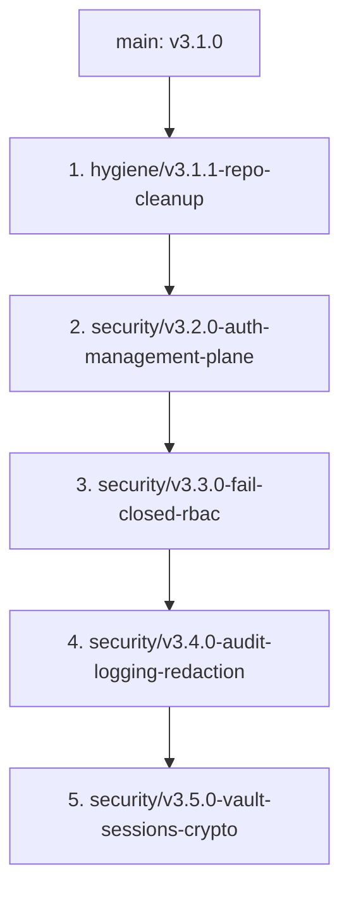

# CSharp-MCP-Router Security Hardening & Modularization Spec

This document specifies the design and implementation roadmap for resolving the 19 security, architectural, and hygiene defects identified in the CSharp-MCP-Router v3.0.8 codebase.

---

## 📅 Roadmap Overview & Stacked Branch Train

We will implement the fixes in a stacked branch train, building sequentially from Branch 1 to Branch 5. Each stage represents a logically bounded set of changes that are independently testable and compiled cleanly.



---

## 🛠️ Detailed Branch Design Specifications

### 1. Branch 1: `hygiene/v3.1.1-repo-cleanup`
*   **Goal:** Clean up the repository build artifacts, address dependency warnings, and secure sensitive config files from accidental commits.
*   **Target Files:**
    *   Modify: `mcp-router.csproj` (remove `NU1903` suppression, update vulnerable packages if found)
    *   Create: `.dockerignore`
    *   Modify: `.gitignore`
    *   Delete/Remove from Git index: `mcp_server.log`, `data/router.db`
    *   Move: `take_screenshots.js` ➡️ `scripts/take_screenshots.js`
*   **Hygiene Fixes:**
    *   Add `*.log`, `data/router.db*`, `data/*.key`, `wwwroot/assets/` to `.gitignore`.
    *   Remove `mcp_server.log` and `data/router.db` from git tracking.
    *   Create a complete `.dockerignore` containing:
        ```text
        .git
        **/bin
        **/obj
        *.log
        data/*.db*
        data/*.key
        McpRouter.Tests
        TestResults
        node_modules
        ```

---

### 2. Branch 2: `security/v3.2.0-auth-management-plane`
*   **Goal:** Fully authenticate and authorize all `/api/*` management plane endpoints, remove insecure fallback identities, and restrict CORS.
*   **Target Files:**
    *   Modify: `Extensions/Endpoints/ServerManagementEndpointExtensions.cs`, `Extensions/Endpoints/TestBenchEndpointExtensions.cs`, `Extensions/Endpoints/CustomFilesEndpointExtensions.cs`
    *   Modify: `Controllers/ClientsController.cs`, `Controllers/ProvidersController.cs`, `Controllers/AppKeysController.cs`
    *   Modify: `Extensions/OpenIddictExtensions.cs` (or authentication configuration)
    *   Modify: `Extensions/ServiceCollectionExtensions.cs` (CORS policies)
*   **Design Details:**
    *   Add `[Authorize(Roles = "Administrator")]` or `.RequireAuthorization("AdminPolicy")` to all `/api/*` endpoints.
    *   Remove the `"admin"` user fallback in `ApplicationBuilderExtensions.cs`/API fallbacks.
    *   Disable open dynamic client registration in `AuthorizationController` unless authenticated.
    *   Restrict CORS: strip `AllowAnyHeader()` and credentials sharing default policies unless explicitly configured for secure domains.

---

### 3. Branch 3: `security/v3.3.0-fail-closed-rbac`
*   **Goal:** Enforce fail-closed authorization logic across the routing layers, resolve header-spoofing identity bugs, and establish trusted proxy validation.
*   **Target Files:**
    *   Modify: `Core/Identity/OidcIdentityProvider.cs`, `Core/Identity/ActiveDirectoryIdentityProvider.cs`
    *   Modify: `Core/ClientSession.cs` (refactor `IsUserAuthorizedAsync` to fail-closed)
    *   Modify: `scripts/db/mssql/02_procedures.sql`, `scripts/db/mysql/02_procedures.sql` (Stored procs default access checks)
    *   Modify: `Extensions/Endpoints/ServerManagementEndpointExtensions.cs` (constrain SSRF endpoints)
*   **Design Details:**
    *   **Fail-Closed Authorization:** Ensure that any uncaught exception, empty policy set, or missing `HttpContext` in `ClientSession.IsUserAuthorizedAsync` returns `false` (access denied) and logs an error, rather than fallback-allowing.
    *   **Proxy Verification:** In `OidcIdentityProvider.cs`, set `RequireTrustedProxy = true` by default. Strip all incoming `Remote-User`/`Remote-Groups` headers unless the remote IP is verified to be in the configured `TrustedProxies` list.
    *   **Active Directory Fix:** Ensure `ActiveDirectoryIdentityProvider` wires with Windows/Negotiate authentication handlers correctly or throws if Windows auth is expected but missing.
    *   **SSRF Protection:** Validate all user-supplied backend URLs in server creation/update; block loopback, metadata (169.254.254.254), and local link-local subnets unless explicitly allowed by config.

---

### 4. Branch 4: `security/v3.4.0-audit-logging-redaction`
*   **Goal:** Redact sensitive information (Authorization headers, secrets) from all logs, wire the dead `AuditLogger` database sinks, and secure SSE token query-strings.
*   **Target Files:**
    *   Modify: `Core/Logging/AuditLogger.cs`, `Core/Logging/PiiSanitizer.cs`
    *   Modify: `Core/ClientSession.cs` (call audit logging on dispatch)
    *   Modify: `Extensions/Endpoints/McpProtocolEndpointExtensions.cs` (call audit logging)
*   **Design Details:**
    *   **Wire Auditing:** Inject `IAuditLogger` into data plane endpoints and routing execution gates. Log every call (`CallTool`, `ReadResource`, `GetPrompt`) to `sp_InsertAuditLog` with details of user identity, target, permissions, and duration.
    *   **Logger Sanitization:** Modify `PiiSanitizer` to comprehensively match and strip `Authorization` headers, `mcp-` app keys, and values like `api_key`/`password` from logged request bodies. Run the console/memory logger pipeline through this sanitizer.
    *   **SSE Query Parameter Handling:** Exclude query token parameters from logging.

---

### 5. Branch 5: `security/v3.5.0-vault-sessions-crypto`
*   **Goal:** Source SQLCipher database and symmetric keys from HashiCorp Vault, adopt secure authenticated encryption (AES-GCM), implement opaque session keys, and clean up cryptographic vulnerabilities.
*   **Target Files:**
    *   Modify: `Core/Secrets/VaultSecretRetriever.cs`, `EncryptionKeyProvider.cs`
    *   Modify: `Core/Secrets/SymmetricEncryptionHelper.cs` (move to AES-GCM)
    *   Modify: `Middleware/AppKeyAuthenticationHandler.cs` (hash comparison & timing)
    *   Modify: `Core/SessionManager.cs` (opaque session IDs)
*   **Design Details:**
    *   **Vault Integration:** Settle on dynamic AppRole authentication with token/lease renewal. Block bootstrap fallback to cleartext local `.key` files next to the database unless Vault is unavailable and an explicit override is set.
    *   **AES-GCM Symmetric Cryptography:** Update `SymmetricEncryptionHelper` to use AES-GCM (generating tag and IV) rather than AES-CBC, removing padding attacks/malleability concerns.
    *   **Opaque Session Keys:** Generate cryptographically secure random session IDs for connected SSE streams, mapping to the authenticated user. Never reuse bearer tokens as session identifiers.
    *   **Constant-Time Verification:** Use PBKDF2/Argon2 one-way hashes for App Keys rather than reversible AES decryption, and verify with `CryptographicOperations.FixedTimeEquals`.

---

## 🧪 Verification & Test Strategy

For each branch, we will:
1.  Verify the compilation succeeds using `./commit.sh`.
2.  Run the full xUnit test suite (`dotnet test McpRouter.slnx`).
3.  Add specific negative regression unit tests verifying:
    *   Fail-closed authorization (verify exceptions yield `false`).
    *   Identity headers from untrusted IPs are dropped.
    *   Management endpoints reject unauthenticated queries.
    *   Sensitivities/PII are redacted in logs.
