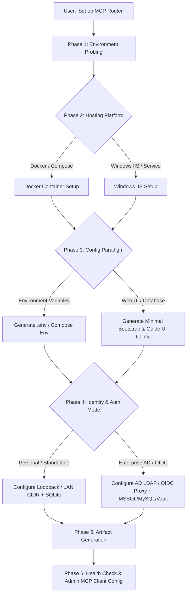

# Design Specification: Universal MCP Router Setup Skill (`mcp-router-setup`)

**Spec Date:** 2026-08-18  
**Feature Name:** `mcp-router-setup` Universal Agentic Skill  
**Target Release:** `v4.19.0+`  
**Locations:** `skills/mcp-router-setup/SKILL.md` and `.agents/skills/mcp-router-setup/SKILL.md`

---

## 1. Executive Summary & Purpose

The `mcp-router-setup` skill is a universal, self-contained AI agent skill following the [AgentSkills.io](https://agentskills.io/specification) standard. It enables any AI coding or operations assistant (Antigravity, Claude Code, Cursor, Cline, Windsurf, Copilot CLI) to painlessly guide users through installing, configuring, and bootstrapping the `CSharp-MCP-Router` in any workspace or server directory without requiring them to clone or compile the C# source code.

The skill supports:
1. **Hosting Platforms**: Docker Container / Docker Compose and Windows Server IIS / Windows Service.
2. **Configuration Modality**: Interactive comparison of **Environment Variables** (`.env` / Docker env) vs. **Web UI & Database** (dynamic zero-downtime hot reloading / Admin MCP Server).
3. **Infrastructure & Network Topology**:
   - **Personal / Home-Lab (Standalone Mode)**: Zero-configuration local loopback (`127.0.0.1`, `::1`) or private LAN subnet (`Admin:StandaloneAllowedNetworks` / `0.0.0.0/0`) with SQLite.
   - **Enterprise Mode**: Active Directory (Windows Authentication / LDAP SIDs `S-1-5-32-544`), OIDC / Reverse Proxy forward-auth headers (Authentik, PocketID, Authelia, Keycloak), multi-database backends (MSSQL, MySQL, SQLite), and Secret Providers (HashiCorp Vault KV v2, Windows DPAPI).
4. **Automated Environment Probing**: Probes for existing Docker daemon socket, HashiCorp Vault environment variables (`VAULT_ADDR`), Windows Active Directory domain context (`USERDNSDOMAIN`), and generates cryptographically secure 256-bit `ROUTER_MASTER_KEY` values.

---

## 2. Skill Discovery & Metadata

### 2.1 Frontmatter (`SKILL.md`)
```yaml
---
name: mcp-router-setup
description: Use when installing, configuring, deploying, or bootstrapping the CSharp-MCP-Router gateway in a new or existing environment (Docker, Docker Compose, or Windows IIS) for personal home-lab or enterprise use.
---
```

### 2.2 Trigger Conditions & Keywords
- Trigger phrases: `"set up mcp router"`, `"install mcp gateway"`, `"configure mcp router"`, `"deploy mcp router"`, `"docker compose mcp router"`, `"iis mcp router setup"`.
- Error & symptom cues: Missing `ROUTER_MASTER_KEY`, container restart loops due to unconfigured database, connecting agents to router Admin MCP Server.

---

## 3. Interactive Setup Workflow & Decision Logic



### Phase 1: Environment Probing
Before prompting the user, the agent inspects the host environment:
1. **OS & Platform**: Detects Linux, macOS, or Windows (`uname` / `$PSVersionTable`).
2. **Docker Daemon**: Checks if `docker info` or `/var/run/docker.sock` is accessible.
3. **Secret Stores**: Checks if `VAULT_ADDR` or `VAULT_TOKEN` are set.
4. **Active Directory**: Checks if `USERDNSDOMAIN` or `LOGONSERVER` environment variables are present on Windows.

### Phase 2: Hosting Platform Selection
The agent asks the user to choose their deployment target:
- **Option 1: Docker / Docker Compose** (Recommended for Linux, macOS, WSL2, Home-Lab servers).
- **Option 2: Windows IIS / Windows Service** (For enterprise Windows Server with Windows Authentication and DPAPI).

### Phase 3: Configuration Paradigm (Env vs. UI / Database)
The agent explains the trade-offs:
- **Environment Variables (`.env` / Docker / System Env)**:
  - *Pros*: 12-factor standard, immutable, version-controllable in Git/CI/CD, declarative.
  - *Cons*: Adding/updating servers or settings requires container/service restarts; secrets stored in plaintext env files.
- **Web UI & Database (Dynamic / Admin MCP Server)**:
  - *Pros*: Zero-downtime dynamic hot reloading, AES-256-GCM / SQLCipher encryption at rest, multi-admin audit logging, autonomous agent administration via `/admin`.
  - *Cons*: State resides in database file/server (requires volume backups); requires master key bootstrap.

### Phase 4: Identity & Network Topology
- **Personal / Home-Lab (Standalone Mode)**:
  - Selects SQLite database (`data/mcp_router.db`).
  - Sets `Admin:StandaloneAllowedNetworks` to loopback (`127.0.0.1`, `::1`) or private LAN subnet (e.g. `10.0.0.0/8`, `192.168.1.0/24`, or `0.0.0.0/0`).
  - Generates the default Admin AppKey for AI IDE access.
- **Enterprise Mode**:
  - Database selection: Microsoft SQL Server, MySQL, or SQLite.
  - Identity Provider:
    - *Active Directory*: AD LDAP URL, Domain, Admin SID (`S-1-5-32-544`).
    - *OIDC / Reverse Proxy*: Trusted proxy IP/CIDR (`Oidc:TrustedProxies`), forward-auth headers (`Remote-User`, `Remote-Groups`, `Admin:GroupName`).
  - Secret Provider: HashiCorp Vault KV v2 or Windows DPAPI.

### Phase 5: Artifact Generation
1. **Master Key Generation**:
   - Generates 256-bit cryptographically secure Base64 key:
     - Linux/macOS: `openssl rand -base64 32`
     - Windows PowerShell: `[Convert]::ToBase64String((1..32 | ForEach-Object { Get-Random -Minimum 0 -Maximum 256 } | ForEach-Object { [byte]$_ }))`
2. **Configuration File Generation**:
   - `docker-compose.yml` or `web.config` + `appsettings.Production.json`.
   - `.env` file containing master key, CORS origins, and network settings.

### Phase 6: Health Verification & Client Connection
1. Launch container / start IIS application pool.
2. Probe `GET /health` and `GET /sse`.
3. Output ready-to-copy client config for Claude Desktop, Cursor, Cline, Windsurf, and Antigravity CLI.

---

## 4. Scaffold Templates & Content

### 4.1 Production `docker-compose.yml`
```yaml
services:
  mcp-router:
    image: ghcr.io/spelech/mcp-router:latest
    container_name: mcp-router
    restart: unless-stopped
    ports:
      - "8080:8080"
    environment:
      - DB_PROVIDER=${DB_PROVIDER:-sqlite}
      - ROUTER_MASTER_KEY=${ROUTER_MASTER_KEY}
      - CORS_ALLOWED_ORIGINS=${CORS_ALLOWED_ORIGINS:-http://localhost:3000}
      - Admin__StandaloneAllowedNetworks__0=${STANDALONE_ALLOWED_NETWORK:-127.0.0.1}
      - Admin__StandaloneAllowedNetworks__1=::1
    volumes:
      - ./data:/app/data
      - /var/run/docker.sock:/var/run/docker.sock
```

### 4.2 Production IIS `web.config`
```xml
<?xml version="1.0" encoding="utf-8"?>
<configuration>
  <system.webServer>
    <handlers>
      <add name="aspNetCore" path="*" verb="*" modules="AspNetCoreModuleV2" resourceType="Unspecified" />
    </handlers>
    <aspNetCore processPath="dotnet" arguments=".\mcp-router.dll" stdoutLogEnabled="false" stdoutLogFile=".\logs\stdout" hostingModel="inprocess">
      <environmentVariables>
        <environmentVariable name="ASPNETCORE_ENVIRONMENT" value="Production" />
        <environmentVariable name="responseBufferLimit" value="0" />
      </environmentVariables>
    </aspNetCore>
    <security>
      <requestFiltering>
        <requestLimits maxAllowedContentLength="52428800" />
      </requestFiltering>
    </security>
  </system.webServer>
</configuration>
```

---

## 5. Verification Plan

1. **Skill Format & Lint Verification**:
   - Ensure `skills/mcp-router-setup/SKILL.md` adheres to YAML frontmatter schema with `name` and `description` (under 1024 chars).
   - Verify active links, clear code snippets, and complete step-by-step guidance.
2. **Subagent Execution Proof**:
   - Run pressure test scenarios with a subagent tasked with setting up the router in an isolated temporary directory to confirm the agent correctly follows the workflow, asks the Env vs UI question, performs probing, and generates valid configuration files.
3. **Living Requirements & Version Alignment**:
   - Verify living catalog sync and documentation integrity.
