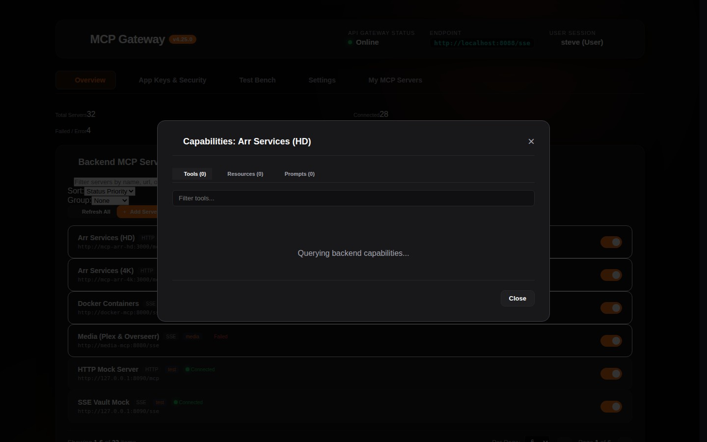
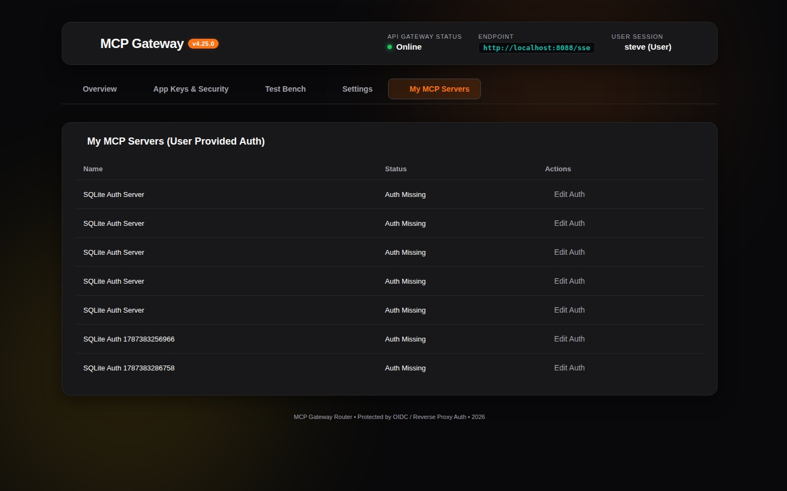

# 01. Dashboard & Navigation Interface

The **Model Context Gateway (MCG) Dashboard** provides a centralized control plane for monitoring, configuring, testing, and securing all connected backend Model Context Protocol (MCP) servers, client connections, and security policies.

---

## 🖥️ Layout & Primary Navigation Tabs


The web interface features a dark-mode glassmorphic design with a fixed top navigation bar that enables one-click switching across primary functional views:

```
+--------------------------------------------------------------------------------------------------------+
| 🌐 Model Context Gateway (MCG)  [Overview] [App Keys & Security] [Test Bench] [Settings] [My MCP Servers]  👤 admin |
+--------------------------------------------------------------------------------------------------------+
```

1. **Overview (`Overview`)**: Primary dashboard displaying aggregated operational metrics (`StatsCard`), the backend MCP server catalog, dynamic filtering/sorting toolbars, and the interactive client setup generator.
2. **App Keys & Security (`App Keys & Security` / `My App Keys`)**: Dedicated management plane for generating AppKeys, inspecting connected client agents, configuring least-privilege scopes, managing user quotas, and copying client configuration JSON snippets.
3. **Test Bench (`Test Bench`)**: Interactive developer playground for executing namespaced tools, reading virtual resource URIs, evaluating prompt templates, testing semantic vector search, direct JSON-RPC console, and monitoring live logs.
4. **Settings (`Settings` - Admin Only)**: Multi-tab system configuration for vector embedding engines, Identity & Auth providers, enterprise Secret retrievers, custom JSON specification files, and Access Control policies.
5. **My MCP Servers (`My MCP Servers`)**: Multi-tenant workspace for end-users to manage personal access tokens (PATs), view user-accessible servers, and copy direct personalized connection endpoints.
6. **Identity & Version Badge**: Top-right corner displays the authenticated user identity (resolved via OIDC headers or Active Directory) alongside the live router version.

---

## 📊 Overview View: Statistics & Metric Cards

### Statistics Summary Card (`StatsCard`)
Positioned at the top of the Overview tab, this card aggregates real-time health and catalog metrics:

* **Total Backend Servers**: Total number of registered MCP servers in the database.
* **Healthy Connections**: Count of active servers reporting a healthy connection (`Connected` status).
* **Total Tools**: Aggregated count of all discovered backend tools across active servers.
* **Total Resources & Prompts**: Count of registered virtual resource URIs and prompt templates.
* **Active Clients & AppKeys**: Number of registered external client applications and valid AppKeys.

---

## 🎛️ Server Controls Toolbar: Search, Sort, & Grouping

The server catalog is managed through the interactive **Server Controls Toolbar**:

```
[ 🔍 Search servers by name, ID, category... ] [ Sort: Status ▾ ] [ Group: Category ▾ ] [ + Add Server ]
```

### 1. Real-Time Search & Filtering
* **Instant Filter**: Filters server cards dynamically as you type across server display name, unique ID, base URL/command, or category tags.
* **Category Filtering**: Click category badges or type category names to filter (e.g. `Smart Home`, `Media`, `Infrastructure`, `Cloud`).

### 2. Multi-Mode Sorting
Sort the server catalog by:
* **Status Priority** (Default): Connected servers first, followed by Disconnected, then Disabled.
* **Name (A–Z / Ascending)**: Alphabetical sort by display name.
* **Name (Z–A / Descending)**: Reverse alphabetical sort by display name.
* **Transport Type**: Grouped by `SSE`, `HTTP`, or `STDIO`.
* **Category**: Alphabetical sort by primary category tag.

### 3. Hierarchical Grouping & Collapsible Sections
Organize the server list into collapsible visual accordions:
* **None**: Flat list view with full pagination.
* **Group by Category**: Segregates servers by domain tags (`Media`, `Smart Home`, `Infrastructure`, `Cloud`, `Uncategorized`).
* **Group by Status**: Segregates servers by connection health (`Connected`, `Disconnected`, `Disabled`).
* **Group by Transport Type**: Segregates servers by protocol (`SSE`, `HTTP`, `STDIO`).
* **Collapsible Sections**: Click any section header to collapse or expand the group.

### 4. Dynamic Pagination Toolbar (`PaginationToolbar`)
When viewing flat lists (`Group: None`), the footer toolbar allows:
* Choosing page size: **10**, **25**, **50**, or **All** items per page.
* Navigating between pages with First, Previous, Page Numbers, Next, and Last buttons.

---

## 🗂️ Server Status Cards

Each registered backend MCP server is rendered in an individual glassmorphic card:

```
+---------------------------------------------------------------------------------------------+
| 🟢 Docker Daemon MCP  [docker]                     [SSE] [Tools: 24] [Resources: 6] [Vault] |
| 🔗 http://docker-mcp:8080/sse                      📂 Infrastructure                        |
|                                                                                             |
| [ 👁️ Inspect ]  [ ✏️ Edit ]  [ 🛡️ Policy ]  [ 🔄 Reconnect ]  [ 🗑️ Delete ]                 |
+---------------------------------------------------------------------------------------------+
```

### Card Indicators & Badges
* **Connection Status Indicator**:
  * 🟢 **Green (Connected)**: Active connection; tools/resources cached and operational.
  * 🟡 **Yellow (Connecting / Degraded)**: Initializing connection or experiencing intermittent timeouts.
  * 🔴 **Red (Disconnected / Error)**: Unreachable endpoint, process crash, or invalid credentials.
  * ⚫ **Gray (Disabled)**: Administratively paused; no traffic routed.
* **Transport Badge**: Protocol used (`SSE`, `HTTP`, `STDIO`).
* **Capabilities Badges**: Count of discovered tools, virtual resources, and prompt templates.
* **Secret Provider Badge**: Credential source (`None`, `Env`, `Vault`, `Registry`, `OAuth2`).
* **Category Badges**: Categorization tags applied to the server.

### Card Actions
* **👁️ Inspect**: Opens the Server Inspect Modal displaying full tool JSON schemas, argument specifications, virtual resource URIs, and prompt arguments.
* **✏️ Edit**: Opens the Server Edit Modal to modify display name, URL/command, transport type, headers, categories, or secret provider configurations.
* **🛡️ Policy**: Opens the Policy Modal to define fine-grained Active Directory / OIDC group access rules (Allowed Groups, Denied Groups, Default Allow/Deny).
* **🔄 Reconnect**: Forces an immediate background cache flush and downstream connection reset.
* **🗑️ Delete**: Safely removes the server registration and cleans up in-memory sessions.



---

## 🔑 My MCP Servers (Per-User Provided Credentials)



For multi-tenant environments where individual users bring their own personal access tokens (PATs) or API credentials, the **My MCP Servers** tab allows end-users to securely manage and store isolated credentials encrypted in SQLite or MySQL with the master envelope key.

## 📖 Navigation Flow Summary

```mermaid
graph TD
    Nav[Global Top Navigation] --> Overview[Overview Tab]
    Nav --> Security[App Keys & Security Tab]
    Nav --> TestBench[Test Bench Tab]
    Nav --> Settings[Settings Tab - Admin]
    Nav --> MyServers[My MCP Servers Tab]

    Overview --> Stats[Operational Stats Card]
    Overview --> Controls[Search / Sort / Group Controls]
    Overview --> ServerCards[Server Status Cards]
    Overview --> QuickSetup[Client Setup Guide]

    Security --> AppKeys[AppKey Generation & Scopes]
    Security --> Clients[Connected Clients Registry]
    Security --> Quotas[User Quotas & Lifecycle Limits]
    Security --> SetupSnippets[Client Config Snippets]

    TestBench --> ToolTester[Tool Execution Form Builder]
    TestBench --> ResTester[Virtual Resource Reader]
    TestBench --> PromptTester[Prompt Template Tester]
    TestBench --> SemanticRouter[Semantic Search Simulator]
    TestBench --> RawConsole[JSON-RPC Direct Console]
    TestBench --> LiveLogs[Real-time Terminal Logs]

    Settings --> GenTab[Vector & Search Engines]
    Settings --> IdTab[Identity & Auth Providers]
    Settings --> SecProvTab[Secret Providers Configuration]
    Settings --> FilesTab[Custom Prompts & Resources]
    Settings --> AccessTab[RBAC Policies & Group Mappings]

    MyServers --> PersonalCreds[Personal User Credentials]
    MyServers --> UserEndpoints[Custom Connection Endpoints]
```



