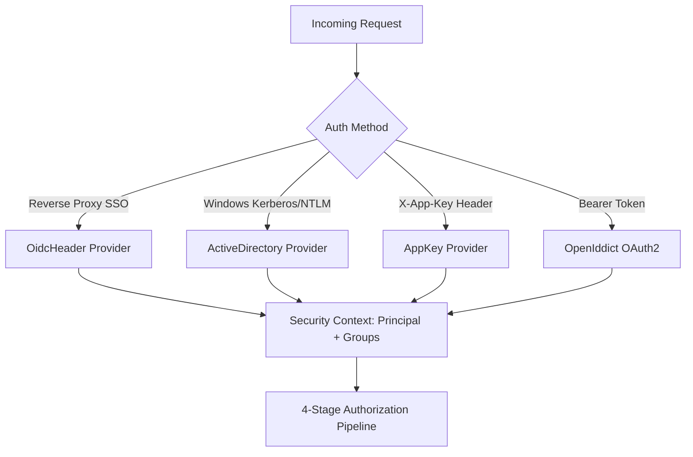

# 03. RBAC, Security & Approvals

The **MCP Gateway Router** enforces multi-stage Role-Based Access Control (RBAC), multi-provider identity resolution, explicit deny safety barriers, and a real-time manual approval queue for sensitive operations.

---

## 🛡️ The 4-Stage Authorization Pipeline

Every request directed at a backend tool, virtual resource, or prompt undergoes rigorous 4-stage pipeline evaluation before execution:

```
                           4-STAGE AUTHORIZATION PIPELINE
                           
                           +----------------------------+
                           |  Incoming MCP Invocation   |
                           | (Principal, Groups, Scope) |
                           +----------------------------+
                                         |
                                         v
                      +--------------------------------------+
                      |  Stage 1: Explicit Deny Evaluation   |
                      |  Is any principal group in Denied?   |
                      +--------------------------------------+
                                  |              |
                              YES |              | NO
                                  v              v
                           [ 403 Forbidden ]  +--------------------------------------+
                                              |  Stage 2: Explicit Allow Evaluation  |
                                              |  Is any principal group in Allowed?  |
                                              +--------------------------------------+
                                                          |              |
                                                      YES |              | NO
                                                          v              v
                                           +-----------------------------------+
                                           | Stage 3: AppKey Scope Evaluation  |
                                           | Does AppKey scope grant access?   |
                                           +-----------------------------------+
                                                          |              |
                                                      YES |              | NO
                                                          v              v
                                                   [ Authorized ]  +-----------------------------------+
                                                                   | Stage 4: Default Policy Fallback  |
                                                                   | Is DefaultAllow enabled on server?|
                                                                   +-----------------------------------+
                                                                               |              |
                                                                           YES |              | NO
                                                                               v              v
                                                                        [ Authorized ] [ 403 Forbidden ]
```

### Stage 1: Explicit Deny Rules (Highest Precedence)
* If **any** of the caller's Active Directory SIDs or OIDC groups match a server's `DeniedGroups` list, the request is immediately rejected (`403 Forbidden`).
* Deny rules always override allow rules or administrative scopes.

### Stage 2: Explicit Allow Rules
* If any of the caller's groups match a server's `AllowedGroups` list, the request passes group-level checks and advances to scope verification.

### Stage 3: AppKey Scope Verification
* When authenticating via an AppKey, the router verifies whether the requested action is permitted by the key's scopes (`*`, `category:<name>`, `server:<id>`, `tool:<name>`, `resource:<uri>`, `prompt:<name>`).

### Stage 4: Default Policy Fallback
* If no explicit group policy matches, the router checks the server's `DefaultAllow` flag. If `DefaultAllow` is `false`, the request is rejected by default (fail-closed security).

---

## 👥 Pluggable Identity Providers

The router determines the caller's identity and group claims through the `IIdentityProvider` interface:



### 1. Reverse Proxy SSO Headers (`OidcHeader`)
* Integrates with identity proxies such as **Authentik**, **Authelia**, **PocketID**, **Keycloak**, or **Traefik/Caddy/Nginx**.
* Inspects standard forward-auth headers:
  * `Remote-User`: Username or UPN (e.g. `admin`).
  * `Remote-Groups`: Comma-delimited list of group claims (e.g. `full_admin, engineering, devops`).
  * `Remote-Email`: User email address.
  * `Remote-Name`: Full display name.

### 2. Active Directory Windows SIDs (`ActiveDirectory`)
* Integrates directly with Windows Domain Controllers and Active Directory.
* Resolves Windows Kerberos / NTLM Security Identifiers (SIDs) and Active Directory group memberships (e.g. `S-1-5-32-544` / Administrators, `Domain Admins`).

### 3. AppKey Authentication (`AppKey`)
* Connects AI agents and external IDEs using cryptographically hashed SHA-256 tokens.
* Maps caller tokens to assigned user identities and fine-grained scope permissions.

### 4. OAuth 2.0 Authorization Server (`OpenIddict`)
* Built-in OAuth 2.0 authorization server for issuing signed access tokens with standard token lifecycles and scopes.

---

## 🎛️ Configuring Access Control & Group Mappings

### 1. Server Policy Configuration Modal
Click **`Policy`** on any server card on the Overview dashboard:

* **Allowed Groups**: Comma-separated group names or SIDs permitted to access this server (e.g. `full_admin, homelab_users`).
* **Denied Groups**: Comma-separated group names or SIDs explicitly blocked from accessing this server (e.g. `contractors, guest_users`).
* **Default Behavior**: Toggle **Allow by Default** or **Deny by Default**.

### 2. Access Control Settings Tab
Navigate to **`Settings`** -> **`Access Control`**:
* **Group Mappings Table**: Map external SSO/AD groups to standardized internal roles.
* **Server Policies Table**: Centralized grid of all server policies with quick inline editing.

---

## 🛑 Manual Tool Execution Approval Queue

To safeguard production environments from unintended or destructive AI agent actions (e.g. `docker__remove_container`, `kubernetes__delete_namespace`, `homeassistant__unlock_door`), the router includes an interactive **Human-in-the-Loop Approval Queue**:

```
                       MANUAL APPROVAL WORKFLOW
                       
   +-------------------+                     +--------------------+
   |  AI Agent / IDE   |                     |  MCP Router        |
   +-------------------+                     +--------------------+
             |                                         |
             | 1. tools/call: docker__rm_container     |
             |---------------------------------------->|
             |                                         | 2. Intercepts call
             |                                         |    Creates PendingApproval
             | 3. Returns Pending (Status: 202)        |    Pushes to Dashboard UI
             |<----------------------------------------|
             |                                         |
             |                                         |       +--------------------+
             |                                         |       | Administrator (UI) |
             |                                         |       +--------------------+
             |                                         |                 |
             |                                         | 4. Views Card   |
             |                                         |<----------------|
             |                                         | 5. Clicks       |
             |                                         |    "Approve"    |
             |                                         |<----------------|
             |                                         |
             |                                         | 6. Executes tool on backend
             | 7. Delivers execution result            |    Logs audit record
             |<----------------------------------------|
```

### Enabling Manual Approvals
1. Navigate to **`Settings`** -> **`Security & Approvals`**.
2. Toggle **`Require Manual Approval for Destructive Tools`** to **ON**.
3. Destructive tool calls will automatically pause and generate approval requests.

### Reviewing & Approving Requests
1. The **Pending Approvals Card** on the Overview dashboard displays all open approval requests in real time.
2. Review the caller identity, tool name, timestamp, and JSON argument payload.
3. Click **`Approve`** to resume execution immediately and deliver the result to the waiting agent.
4. Click **`Reject`** to cancel execution and return an explicit rejection error to the agent.

---

## 🔒 PII Sanitization & Audit Logging

The router features automated payload redaction (`PiiSanitizer`) paired with stored procedure audit logging (`sp_InsertAuditLog`):
* **Automatic Redaction**: Automatically scrubs Bearer tokens, passwords, API keys, and sensitive tokens from audit logs before writing to the database.
* **Audit Metadata**: Captures timestamp, client identity, target server, tool name, execution duration (ms), response status code, and sanitized payload parameters.

For the underlying database schema definitions of security policies and audit tables (`AccessPolicies`, `ToolAccessPolicies`, `AdGroups`, `AuditLogs`), see the [**Database Entity-Relationship Diagram**](../database-providers.md#unified-database-entity-relationship-diagram-erd).
