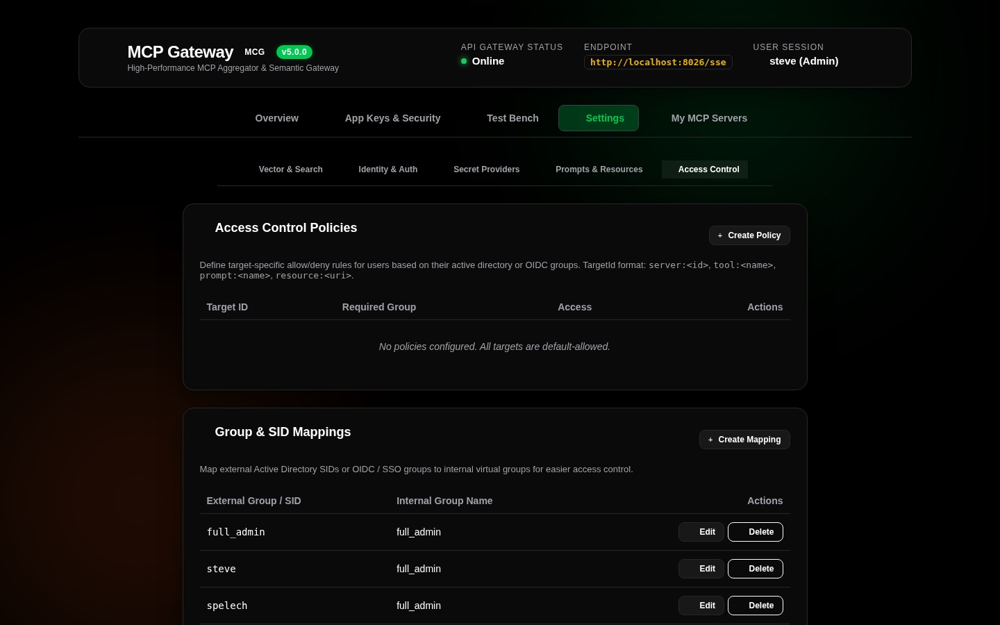
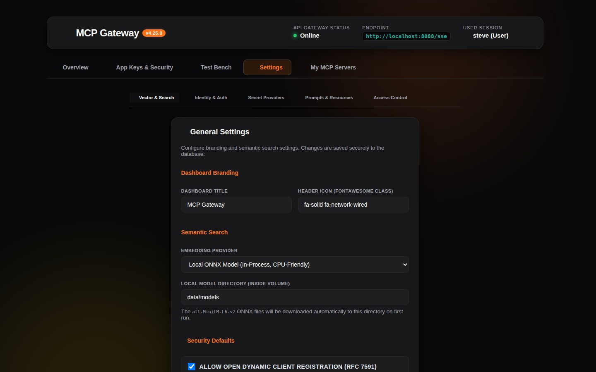
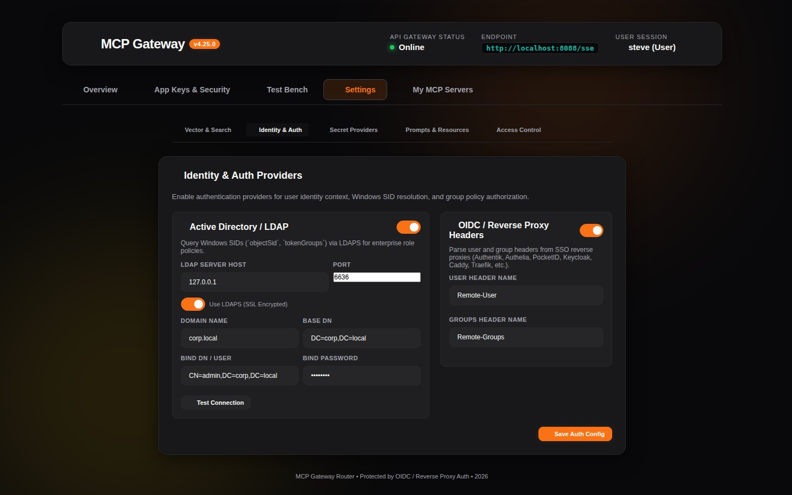
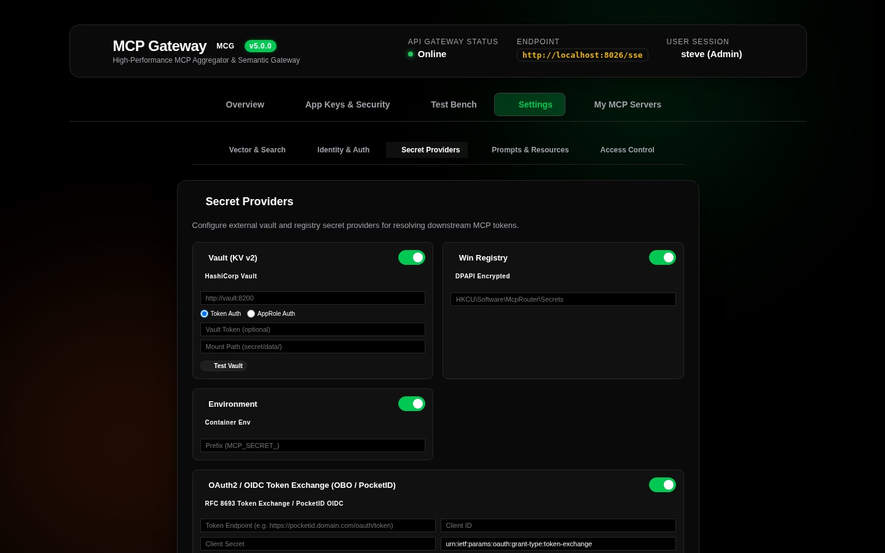
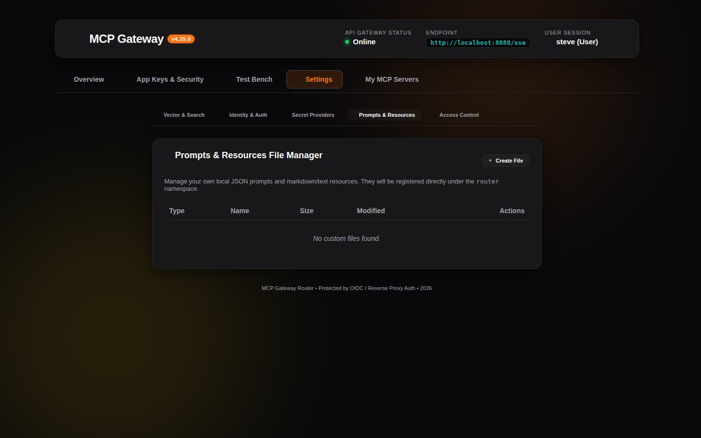

# 06. System Settings & Vector Embeddings

The **Settings View** (`Settings` tab - accessible to administrators) provides a comprehensive configuration plane for adjusting vector embedding search engines, identity & authentication providers, enterprise secret retrievers, custom JSON specification files, and access control matrices.

---

## 🧭 Settings Sub-Navigation Tabs



The Settings interface is organized into 5 modular domain tabs:

```
+-------------------------------------------------------------------------------------------------------------------------+
| [ 🧠 Vector & Search ]  [ 🪪 Identity & Auth ]  [ 🔐 Secret Providers ]  [ 📂 Prompts & Resources ]  [ 👥 Access Control ] |
+-------------------------------------------------------------------------------------------------------------------------+
```

---

## 🧠 Tab 1: Vector & Search Engine (`GeneralTab`)



The vector embedding engine powers the **Meta-Mode** dynamic discovery pipeline (`search_tools`), matching natural language agent queries against the tool catalog:

```
+-------------------------------------------------------------------------------+
| 🧠 Vector Embedding & Semantic Search Configuration                           |
+-------------------------------------------------------------------------------+
| Embedding Engine:     (•) Local ONNX In-Process   ( ) External API Provider   |
|                                                                               |
| [Local ONNX Engine Parameters]                                                |
| Model Architecture:   All-MiniLM-L6-v2 (384-dimensional dense vectors)        |
| Model Cache Path:     [ /data/models                                       ]  |
| Execution Provider:   CPU Multi-Threaded In-Process (Microsoft.ML.OnnxRuntime) |
|                                                                               |
| [External API Provider Parameters]                                            |
| Provider Type:        [ OpenAI / Compatible (LiteLLM, Ollama) ▾ ]             |
| Base API Endpoint:    [ https://api.openai.com/v1                          ]  |
| API Secret Key:       [ sk-proj-********************************           ]  |
| Model Identifier:     [ text-embedding-3-small                             ]  |
|                                                                               |
| [ Save Vector Settings ]                                                      |
+-------------------------------------------------------------------------------+
```

### 1. Local ONNX Engine (Recommended / Default)
* **Model**: Embedded `All-MiniLM-L6-v2` transformer model.
* **Zero External Dependencies**: Runs entirely in-process on CPU using `Microsoft.ML.OnnxRuntime` and `Microsoft.ML.Tokenizers`.
* **Privacy & Air-Gapped**: Queries and tool descriptions never leave the local container.
* **Auto-Initialization**: Model weights and tokenizers are automatically verified and cached in the persistent models directory (`/data/models`).

### 2. External API Provider (OpenAI / Ollama / LiteLLM)
* **Usage**: Ideal when standardizing across external embedding models or connecting to a shared GPU inference cluster.
* **Supported Backends**: OpenAI, Azure OpenAI, Ollama, LiteLLM, Open WebUI, and vLLM.
* **Secure Storage**: External API keys are encrypted at rest in the database using authenticated AES-256-GCM envelope encryption.

---

## 🪪 Tab 2: Identity & Auth Providers (`IdentityAuthTab`)



Manages incoming authentication and user identity resolution:

### 1. Active Directory / Windows SID Provider
* Enable or disable Windows Kerberos/NTLM authentication.
* Configure Domain Controller endpoints, Base DN, and service account credentials.

### 2. OIDC / Reverse Proxy Headers Provider
* Enable or disable header-based identity inspection from reverse proxies (Authentik, Authelia, PocketID, Keycloak, Traefik, Caddy, Nginx, etc.).
* Custom header field names: `Remote-User`, `Remote-Groups`, `Remote-Email`, `Remote-Name`.

### 3. OpenIddict OAuth 2.0 Authorization Server
* Configure OAuth 2.0 token lifetimes (Access Token TTL, Refresh Token TTL).
* X.509 signing certificate paths and encryption keys for distributed microservice trust.

---

## 🔐 Tab 3: Secret Providers (`SecretProvidersTab`)



Manage centralized configurations for external secret stores:
* **HashiCorp Vault KV v2**: AppRole (`roleId` / `secretId`) or direct Token with JIT renewal.
* **Windows Registry**: DPAPI-encrypted secrets stored in `HKLM` or `HKCU`.
* **Container Environment**: Secrets dynamically loaded from prefix-matched container env vars.
* **OAuth2 / OIDC Token Exchange (RFC 8693 / PocketID)**: On-Behalf-Of (OBO) token exchange for downstream tools.

---

## 📂 Tab 4: Prompts & Resources File Manager (`CustomFilesTab`)



Create and manage custom JSON files that define virtual tools, prompt templates, and virtual resource endpoints:

* **File Catalog Grid**: Lists all registered specification files with file name, type (`Tools`, `Prompts`, `Resources`), and last updated timestamp.
* **Interactive Editor & Visual Prompt Builder**: Built-in JSON editor and visual template builder with validation before persistence.
* **Hot Reload**: Instantly updates catalog caches and vector embeddings upon saving.

---

## 👥 Tab 5: Access Control & Group Mappings (`AccessControlTab`)


Fine-tune enterprise permissions across servers and external groups:

* **Group Mappings Table**: Define mappings that translate external Identity Provider groups (e.g. `CN=IT-Admins,OU=Groups,DC=corp` or `S-1-5-21-1001`) to simplified internal roles (`full_admin`).
* **Server Policies Table**: Complete matrix of server-level access rules:
  * Target Identifier (e.g. `server:docker`, `tool:docker__ps`, `prompt:router__diagnose`)
  * Required Group (e.g. `Engineering`, `Administrators`)
  * Mode (`ALLOW Access` or `DENY Access`)

